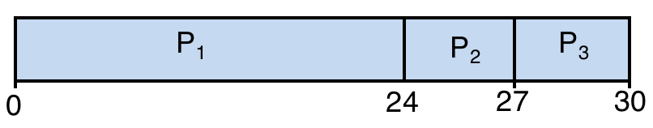
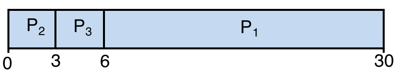
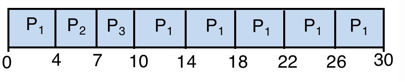
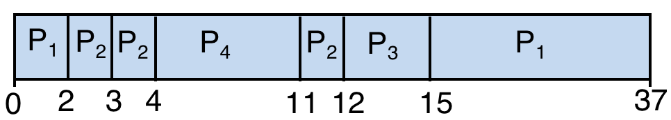

# 进程调度

-   非抢占式
-   抢占式


## 先来先服务FCFS

### 简介

```
最先进入的就绪队列的进程，先运行（先到先得）

优点：简单、易于实现；公平；
缺点：平均等待时间长；短作业不利；紧迫型作业不利；
```


### 举例

| process | time |
| ------- | ---- |
| P1      | 24   |
| P2      | 3    |
| P3      | 3    |

对应的甘特图：



```python
平均周转时间：
	start = 0
	((P1.end - start) + (P2.end - start) + (P3.end - start)) / 3
    ((24 - 0) + (27 - 0) + (30 - 0)) / 3 = 81 / 3 = 27
    
平均等待时间
	t1 = (P1.end - start - P1.runTime) = 24 - 0 - 24
    ...
    t = average = 51 / 3 = 17
```


## 短作业优先SJF

### 简介

```
选择就绪队列中执行时间最短的进程优先执行

优点：平均等待时间最小；系统吞吐量增加
缺点：长作业不利；需知道每个进程的执行时间
```


### 举例

| process | time |
| ------- | ---- |
| P1      | 24   |
| P2      | 3    |
| P3      | 3    |

对应的甘特图：



```python
平均周转时间:
	start = 0
	t1 = P1.end - start = 30 - 0 = 30
    ...
    t = average(t1, t2, t3) = 39 / 3 = 13
   
平均等待时间:
    t1 = P1.end - start - P1.runTime
    ...
    t = average(t1, t2, t3) = 9 / 3 = 3
```


## 时间片轮转RR

### 简介

```
设置使用CPU时间长度，就绪队列中的进程依次轮流分配一个时间片的CPU

优点：平均响应时间短
缺点：性能依赖时间片的大小
```

### 举例

时间片大小 = 4

| Process | time |
| ------- | ---- |
| P1      | 24   |
| P2      | 3    |
| P3      | 3    |

甘特图如下：



```python
平均周转时间：
	start = 0
    t1 = P1.end - start = 30
    ...
    t = average(t1, t2, t3) = 47 / 3
 
平均等待时间：
	t1 = P1.end - start - P1.runTime = 30 - 0 - 24
    ...
    t = average(t1, t2, t3) = 17 / 3
```


## 优先权调度

### 简介

```
优先级高的先响应

类型：抢占式、非抢占式
优先权类型：静态优先权、动态优先权
```

### 举例

| process | runTime | arriveTime | priority |
| ------- | ------- | ---------- | -------- |
| P1      | 24      | 0          | 4        |
| P2      | 3       | 2          | 2        |
| P3      | 3       | 3          | 3        |
| P4      | 7       | 4          | 1        |

甘特图如下：



```python
平均周转时间：
	t1 = 37 - 0
    ...
    t = average(t1, t2, t3, t4) = 66 / 4

平均等待时间：
	t1 = 37 - 24
    t = 29 / 4
```


## 高响应比优先HRRN

### 简介

```
响应比：
	Rp = 1 + (等待时间/运行时间)
	
    对于同时到达的任务处理时间较短的任务将被优先调度
	处理时间较长的任务将随着时间的增加而动态提升响应比
	因而不会出现饥饿现象。
```


# 总结

-   进程调度算法是操作系统中进程管理的重要组成部分
-   衡量调度算法的优劣可以从用户和系统两个角度分析
-   实时系统的调度和多喝系统的调度还要考虑更多

