# 内存管理

## 内存管理的功能

-   内存空间的分配和回收

-   地址转换

    逻辑地址和物理地址的转换

-   内存空间的扩容

-   存储保护

## 重定位

### 静态重定位

程序入主存之前由编译/链接程序完成重定位，入主存可立即执行。

```
	静态重定位的特点是在一个作业装入内存时，必须分配其要求的全部内存空间，如果没有足够的内存，就不能装入该作业，此外，作业一旦进入内存后，在整个运行期间不能在内存中移动。
```

### 动态重定位

装入程序在把装入模块装入内存后，并不立即把装入模块中的相对地址转换成绝对地址，而是把这种地址转换推迟到程序真正要执行时才进行。因此，装入内存后的所有地址均为相对地址。这种方式需要一个重定位寄存器的支持。

```
动态重定位的特点如下：
	可以将程序分配到不连续的存储区中；
	在程序运行之前可以只装入它的部分代码即可投入运行，然后在程序运行期间，根据需要动态申请分配内存；
	便于程序段的共享，可以向用户提供一个比存储空间大得多的地址空冋.
```

## 覆盖和交换

### 覆盖技术

覆盖的基本思想如下：由于程序运行时并非任何时候都要访问程序及数据的各个部分（尤其是大程序），因此可把用户空间分成**一个固定区和若干覆盖区**。将**经常活跃的部分放在固定区**，其余部分按调用关系分段。首先将那些**即将要访问的段放入覆盖区**，其他段放在外存中，在**需要调用前**，系统再将其调入覆盖区，替换覆盖区中原有的段。

```
覆盖技术的特点是：
	打破了必须将一个进程的全部信息装入主存后才能运行的限制，但当同时运行程序的代码量大于主存时仍不能运行。
	此外，内存中能够更新的地方只有覆盖区的段，不在覆盖区中的段会常驻内存。
```

### 交换技术

把处于等待状态的程序从内存移动到辅存，把内存空间腾出来，这一过程又称**换出**；把准备好竞争CPU运行的程序从辅存移动到内存，这一过程又称**换入**。

中级调度采用的就是交换机技术。

覆盖技术已成历史；交换技术仍然具有较强的生命力。

## 连续分配方式

### 单一连续分配

内存分为系统区和用户区。系统区仅供操作系统使用，通常在低地址部分；用户区市为用户提供的、除系统区之外的内存空间。

优点：简单、无外部碎片，可以采用覆盖技术，不需要额外的技术支持。

缺点：只能用于单用户，单任务的操作系统中，有内部碎片，存储器利用率极低


### 固定分区分配

把用户内存空间划分为若干个固定大小的区域，每个分区只装入一道作业。当有空闲分区时，便可再从外存的后备作业队列中选择适当大小的作业装入该分区，如此循环。

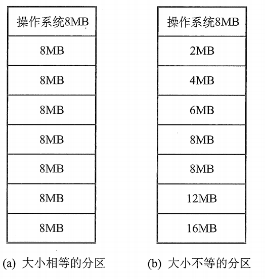

-   大小相等的分区。用于利用一台计算机区控制多个相同对象的场合，缺乏灵活性。
-   大小不等的分区。划分为多个较小的分区、适量的中等分区和少量大分区

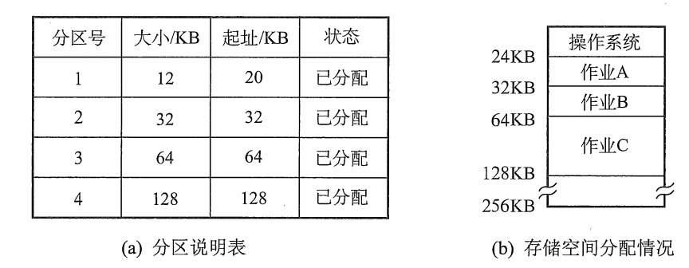

```
存在的问题：
	程序可能太大而放不进任何一个分区中，不得不使用覆盖技术
	主存利用率低，程序小于固定分区大小时，也占用一个分区块，造成浪费，称为 内部碎片
```

### 动态内存分配

又称可变分区分配。

不预先划分内存，而是在进程装入内存时，根据进程的大小动态地创建分区，并使得分配的大小刚好适合进程的需要。 分区的大小和数目时可变的

#### 举例

```
系统有 64MB 的内存空间。
其中低8MB 分配给操作系统，其余为用户可用内存。
开始时装入前三个进程，内存剩下 4MB， 进程4无法装入。
```

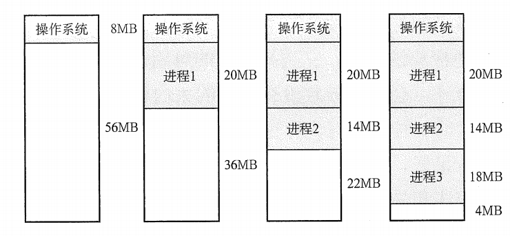

```
在某个时刻，内存中没有一个就绪进程，CPU出现空闲。
操作系统换出进程2， 换入进程4。
由于进程4 比 进程2 小，这样就产生了一个 6MB 的内存块
```

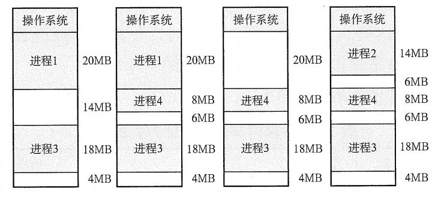

```
在之后会导致内存中出现许多小的内存块，内存的利用率下降。小的内存块称为外部碎片
克服外部碎片可通过紧凑技术来解决，即时不时的对进程进行移动和整理。
类似于 windows的磁盘整理
```

#### 分配策略

-   首次适应（First FIt）算法。空闲分区以**地址**顺序排列，找到大小能满足要求的第一个分区即可
-   最佳适应（Best Fit）算法。空闲分区以**容量**顺序排列，找到第一个能满足要求的分区
-   最坏适应（Worst Fit）算法。又称最大适应（Largest Fit）算法，空闲分区以**容量递减**的次序链接，找到第一个能满足要求的空闲分区（即最大的分区）。
-   邻近适应（Next Fit）算法。又称循环首次适应算法，由首次适应算法演变而成。**不是从开头查找，而是上次查找结束的位置开始继续查找**

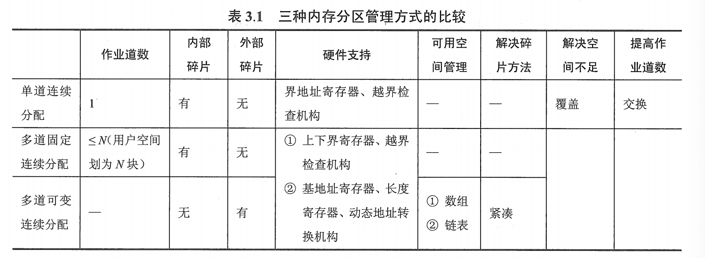

## 非连续分配管理方式

离散分配管理方式

### 基本分页式存储管理

**不会产生外部碎片**

**每个进程平均产生半个块大小的内部碎片**

#### 基本概念

-   页面和页面大小。内存中的块称为页框（Page Frame），外存的称为块（Block）。页面大小是 2^n，同时应该适中。页面太小会使进程页面数过多，这样页表就会过长，占用大量内存，也会增加地址转换的开销；页面过大会使业内碎片增多，降低内存利用率。

-   地址结构

    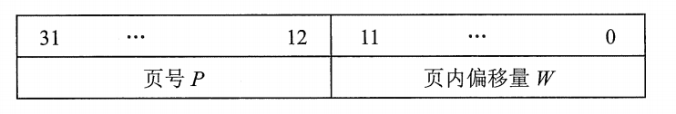

    地址结构决定了虚拟内存寻址空间有多大。

-   页表。记录页面在内存中对应的物理块号，便于在内存中找到进程每个页表所对应的物理块。

    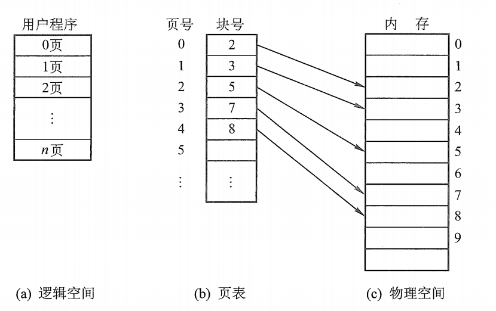

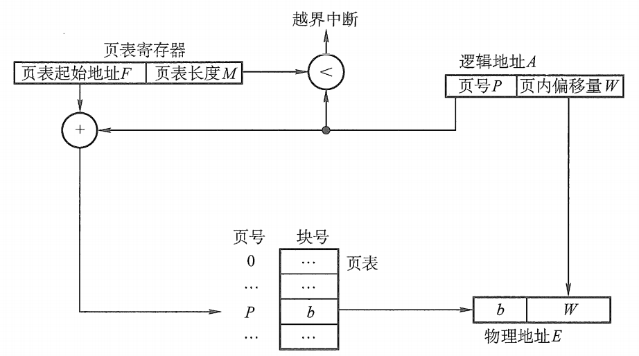

#### 例题

```
已知某分页系统，主存为64K，页面大小为1K，对一个4页大的作业，其0、1、2、3页分别被分配到主存的2、3、6、8块中，将十进制的逻辑地址2500、4500转换为物理地址？
```

```c
2500:
	pageIndex = int(2500 / 1024) = 2;
	pageOffset = 2500 % 1024;
	blockIndex = 6;							// 第2页 对应主存第6块。
	blockBase = blockIndex * 1024;
	addr = blockBase + pageOffset;

4500:
	pageIndex = int(4500 / 1024) = 4;
	pageOffset = 4500 % 1024;
	blockIndex = 8;
	blockBase = 8 * 1024;
	addr = blockBase + pageOffset;
```

#### 具有快表的地址变换结构

快表，用来存放当前访问的若干页表项，以加速地址变换的过程。相应的，主存中的页表称为慢表。

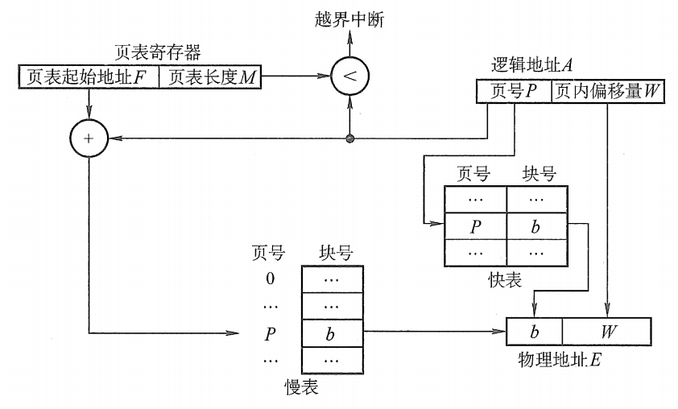

1.  CPU给出逻辑地址之后，由硬件进行地址转换，将页号送入高速缓存寄存器，并将此页号与快表进行比较。
2.  若找到匹配的页号，说明所要访问的页表项在快表中，直接取出页框号，加上偏移量形成物理地址。
3.  若没有找到匹配的，访问主存，读出页表项之后，加入快表中。若快表已满，则必须按照一定的算法对旧的进行替换。

#### 两级页表

当页表过大（比如页表需要4MB的空间）时，为了压缩页表，且不用把所用的页面都调入内存，只在需要的时候调入，构建出二级页表，解决占用内存空间过大的问题。

为了查询方便，顶级页表最多只有**一个页面（1K 个表项）**

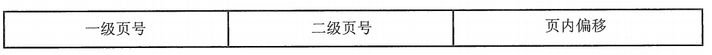

### 基本分段存储管理方式

#### 基本概念

-   分段。段式管理按照用户进程中的自然段划分逻辑空间。

    例如，有主程序，两个字程序，栈和一段数据组成，那么就划分成5个段，并分配一段连续的地址空间（段内连续，段间可以不连续）

    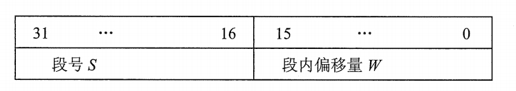

-   段表。每个进程都有一张逻辑空间与内存空间映射的段表，其中每个段表项对应进程的一段，段表项纪录该段在内存中的始址和长度

    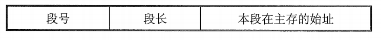

-   地址变换机构。为了实现变换过程，设置了段表寄存器，放段表始址F，段表长度M

    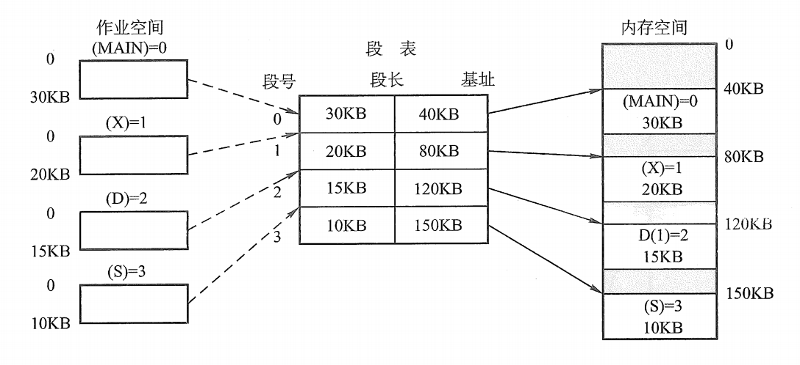

寻址过程如下：

​	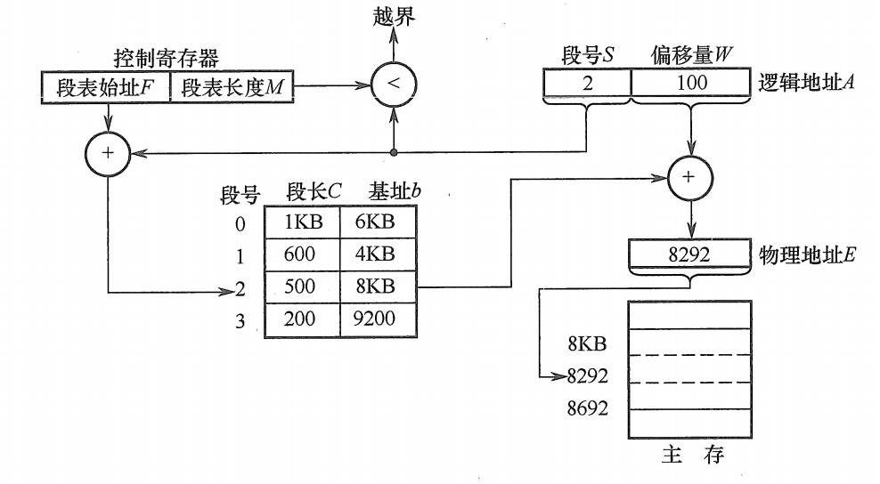

### 保护机制

分段：

-   存取控制保护

    设置相关保护位：只读，只写，只执行

    合法标志

-   地址越界保护

    将段表寄存器中的`段表长度`与`逻辑地址中的段号`比较，若段号大于段表长度，则产生越界中断；并且比较`段长`和`偏移`，若偏移大于段长，也会产生越界中断。

分页：

-   越界保护

    只判断页号是否越界，因为页内偏移不可能越界

-   存取控制保护


### 分段和分页的三个主要区别

-   页是信息的物理单位，为实现离散存储，提高内存利用率而引入；段是信息的逻辑单位；为满足用户要求而引入
-   页的大小固定且由操作系统确定；段长不定，取决于用于程序，并在编译时划分
-   分页的作业地址空间是一维的；分段的作业地址空间是二维的


### 段页式管理方法

结合段式管理和页式管理，形成了段页式管理

在段页式系统中，作业的地址空间首先被分成若干逻辑段，每段都有自己的段号，然后将每段分成若干大小固定的页。对内存空间的管理仍然和分页存储管理一样，将其分成若干和页面大小相同的存储块，对内存的分配以存储块为单位。

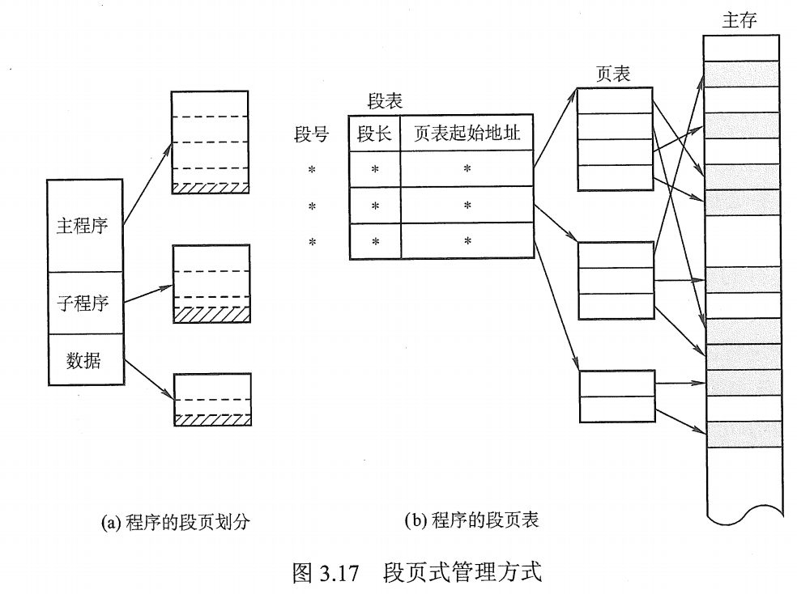

在段页式系统中，逻辑地址分成三部分：**`段号、页号、页内偏移量`**

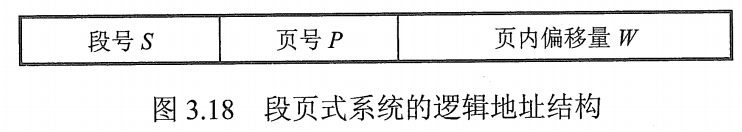

段表只有一个，而页表可以有多个

寻址方式如下：

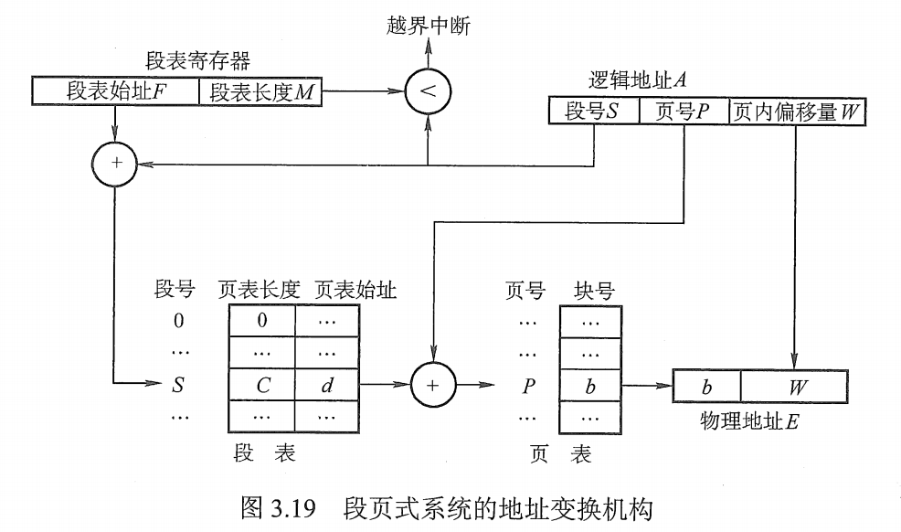


# 总结

| **管理方式**       | **数据结构**                          | **分配和回收** | **碎片情况**   |
| ------------------ | ------------------------------------- | -------------- | -------------- |
| 固定分区分配       | 分区表                                | 简单           | 内碎片（最多） |
| 动态分区分配       | 空闲分区表 或已分分区表               | 4种回收情况    | 外碎片（多）   |
| 动态重定位分区分配 | 空闲分区表或已分分区表                | 紧凑           | 外碎片（少）   |
| 覆盖和交换         | 空闲分区表或已分分区表、 进程管理结构 | ——             | ——             |
| 分页               | 页表、bitmap                          | 地址转换机构   | 内碎片（少）   |
| 分段               | 段表、空闲分区表                      | 地址转换机构   | 外碎片（多）   |
| 段页式             | 段表和页表、bitmap                    | 地址转换机构   | 内碎片（多）   |

