# 磁盘IO

## 磁盘结构

### 磁盘

```
	在读写操作期间，磁头固定，磁盘高速旋转
	数据在一组同心圆中，称为磁道。每个磁道与磁头一样宽，一个盘面上有上千个磁道
	磁道又划分成几百个扇区，每个扇区固定存储大小（通常为512B），一个扇区称为一个盘块。
	磁盘的存储能力受限于最内道的最大记录密度。
```

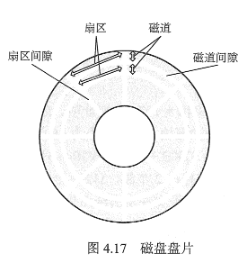

### 磁盘驱动器

磁盘安装在一个磁盘驱动器中，它是由头臂、用于旋转磁盘的主轴和用于数据输入/输出的电子设备组成

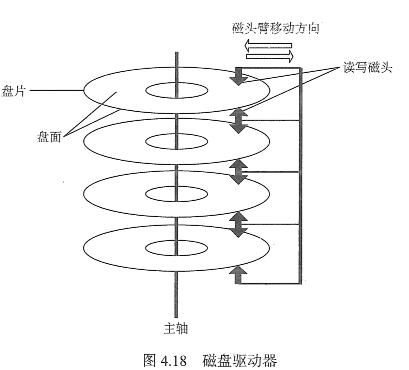

```
固定头磁盘：磁盘相对于盘片的径直方向固定
活动头磁盘：磁头可移动的

固定盘磁盘：磁盘永久固定在磁盘驱动器内的
可换盘磁盘：可移动的和替换的
```


## 磁盘调度算法

磁盘读写操作的时间由 **寻找时间、延迟时间、传输时间**决定

-   寻道时间 Ts。活动头磁盘在读写信息前，将磁头移动到指定磁道所需要的时间，这个时间除了跨越n条磁道的时间外，还包括启动磁臂的时间s，即

    
    $$
    T{s} = m * n + s
    $$
    其中 m是与磁盘驱动器速度相关的常数，约为 0.2ms，磁臂启动的时间约为s = 2ms；

-   延迟时间 Tr。磁头定位到某一磁道的扇区所需要的时间，设转速为r，则
    $$
    T{r} = \frac{1}{2r}
    $$
    对于硬盘，典型的旋转速度为 5400转/分，相当于一圈11.1ms，则Tr=5.55ms，

    对于软盘，300 ～ 600 转/分，则Tr为 50 ～ 100 ms

-   传输时间Tt。从磁盘读出或写入所经历的时间，取决于字节数b和磁盘的旋转速度r
    $$
    T{t} = \frac{b}{rN}
    $$
    r为转速，N为一个磁道上的字节数。

所以平均存取时间
$$
T{a} = T{s} + \frac{1}{2r} + \frac{b}{rN}
$$

### 先来先服务（FCFS）算法

根据进程请求访问磁盘的先后顺序进行调度，是最简单的调度算法。

优点是具有公平性

#### 举例

```
请求顺序为 55, 58, 39, 18, 90, 160, 150, 38, 184
初始位置是磁道 100
```

运动过程如图所示，总共移动了 498个磁道，平均查找长度 = 498 / 9 = 55.3

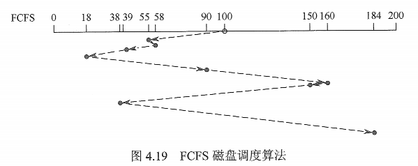


### 最短优先（SSTF）算法

寻找与当前磁头所在磁道距离最近的磁道。

性能比FCFS好

会产生`饥饿现象`

#### 饥饿现象

若初始位置为18， 在18附近频繁的增加新的请求，则磁头长时间在18 附近工作，使得184号被无限期推迟，即“饿死”

#### 举例

还是上面的实例

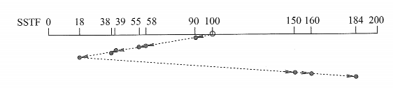

共移动了 248个磁道，平均寻找长度 = 248/9 = 27.5

### 扫描（SCAN）算法

又称电梯调度算法，在最短优先的基础上，规定了磁盘的运动方向

对最近扫描过的区域不公平，因此在访问局部性方面不如FCFS和SSTF好


#### 举例

规定初始时朝着磁道号增大的顺序移动

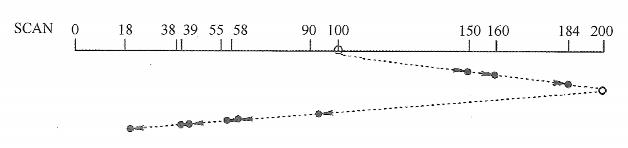

共移动了 282个磁道，平均长度 = 282 / 9 = 31.33

### 循环扫描（C-SCAN）算法

在扫描算法的基础上规定磁头单向移动来提供服务

#### 举例

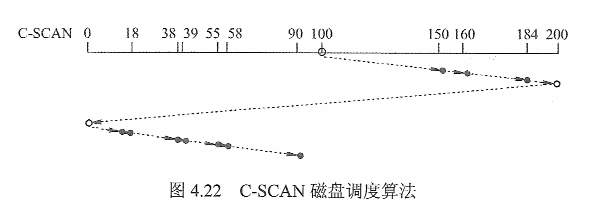

390

390 / 9 = 43.33

#### 改进

不移动到开头，而是移动到最远的一个端

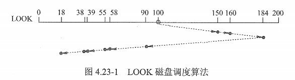

称为`Look`调度

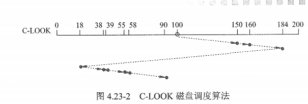

>   若无特殊说明，可以默认SCAN C-SCAN 为LOOK C-LOOK

### N步扫描（N-SCAN）算法

把请求队列N个分组，

对每个分组使用SCAN算法

### 比较

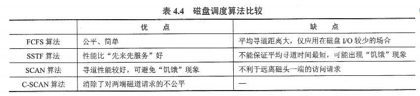

# 外存分配方法

-   [连续分配](#连续分配)
-   [链接分配](#链接分配)

## 连续分配

连续分配方法要求每个文件在磁盘上占有一组连续的块。

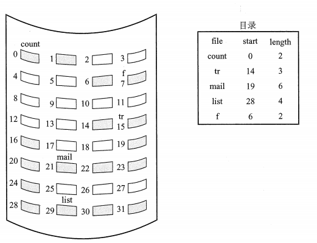

支持顺序访问和直接访问

优点：

-   实现简单、存取速度快

缺点：

-   文件长度不宜动态增加
-   会产生外部碎片
-   只适用于长度固定的文件

## 链接分配

优点：

-   消除了外部碎片，显著提高了磁盘空间利用率
-   无需提前知道文件的大小。
-   对文件的增删改也非常方便

### 隐式链接

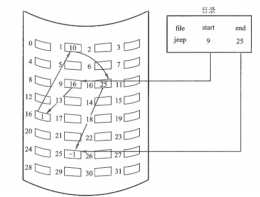

除了最后一个盘块之外，每个盘块都有指向下一个盘块的指针

缺点

-   无法直接访问盘块，只能通过指针顺序访问，盘块指针消耗存储空间
-   稳定性不够好

### 显式链接

```
是指把用于连接文件各个物理块的指针，从尾部提取出来，显式的存放在内存的一张链接表中。
这张表在磁盘里面只有一张，被称为文件分配表（FAT）
```

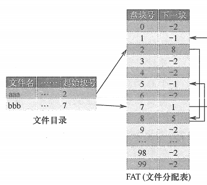

## 索引分配

解决了连续分配的外部碎片和文件大小管理的问题，但是链接分配不能有效支持访问（FAT除外）。索引分配解决了这个问题

他把文件所有的盘块号集中放一起，构成索引表

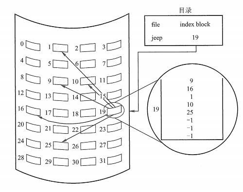

每个文件都有一个索引块，因此索引块应该尽量小，但是太小就无法支持大文件。

### 链接方案

一个索引块通常为一个磁盘块。为了处理大文件，可以将多个索引块链接起来

### 多层索引

类似于多级页表那种

### 混合索引

系统既采用直接地址，又采用单级索引分配方式或两级索引分配方式

### 比较

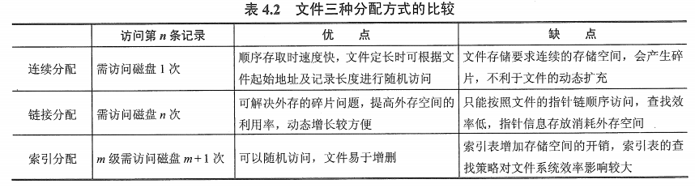

# 空闲空间的管理

-   设置相应的数据结构，记录空闲存储空间的分配情况
-   实现存储空间的分配和回收

## 空闲表法


属于连续分配方式，与内存的动态分配类似

系统为外存上的所有空闲区建立一张空闲盘表，每个空闲区对应于一个空闲表项


空闲盘曲的分配与内存的动态分配类似，同样采用首次适应算法、循环首次适应算法等

-   ​        例如，在系统为某新创建的文件分配空闲盘块时，先顺序地检索空闲盘块表的各表项，直至找到第一个其大小能满足要求的空闲区，再将该盘区分配给用户，同时修改空闲盘块表。

在回收时，也采用类似于内存回收的算法，即要考虑回收区前后是否需要合并

## 空闲链表法

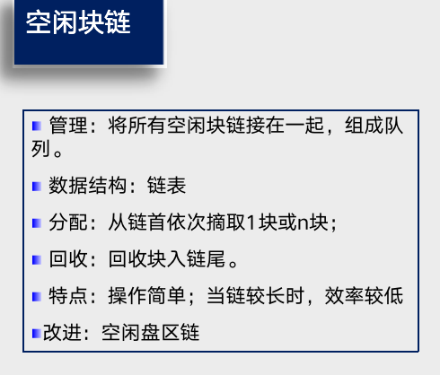

所有的空闲盘区拉成一条空闲链。

感觉上和`fastbin`有点像吧

## 位示图法

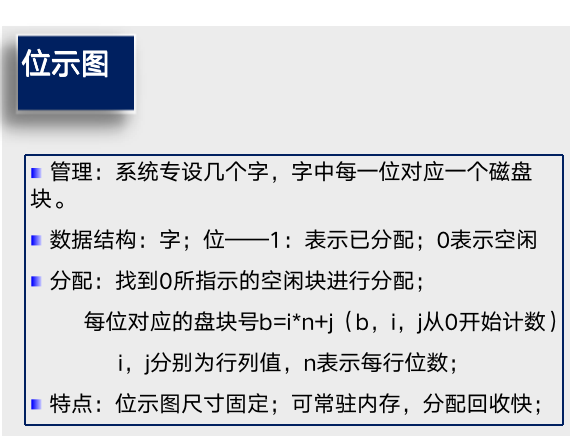

利用二进制的一位来表示磁盘中一个盘块的使用情况，磁盘上所有的盘块都有一个二进制位与之对应。值为0，表示空闲

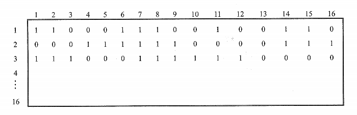

分配：

1.  顺序扫描位示图，从中找出一个或一组值为0（空闲）的二进制位

2.  找到的二进制位转换成与之对应的盘块号。若位于`i行j列`，则 
    $$
    b = n(i - 1) + j
    $$
    其中n代表每一行的位数

3.  修改位示图，令`map[i][j] = 1`

回收：

1.  将回收盘的盘块号转换成行号和列号
    $$
    i = (b - 1) // (n + 1) \\
    j = (b - 1) \% (n + 1)
    $$

2.  修改位示图，令`map[i][j] = 0`;

## 成组链接法

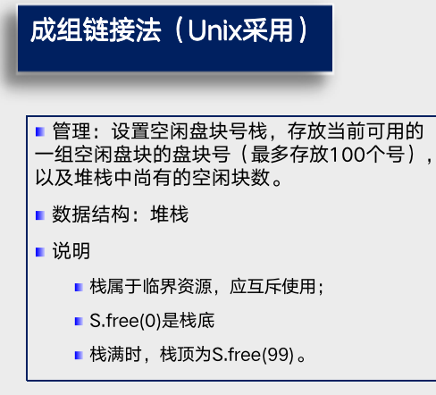

空闲表法和空闲链表法都不适用于大型文件系统，因为空闲表和空闲链表开销过大。

把顺序的n个空闲扇区地址保存在第一个空闲扇区内，其后一个空闲扇区内则保存另一个顺序空闲扇区的指针

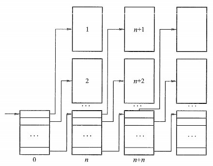

# 文件及目录的实现

## 文件的实现

使用FCB（在文件系统接口中写到）

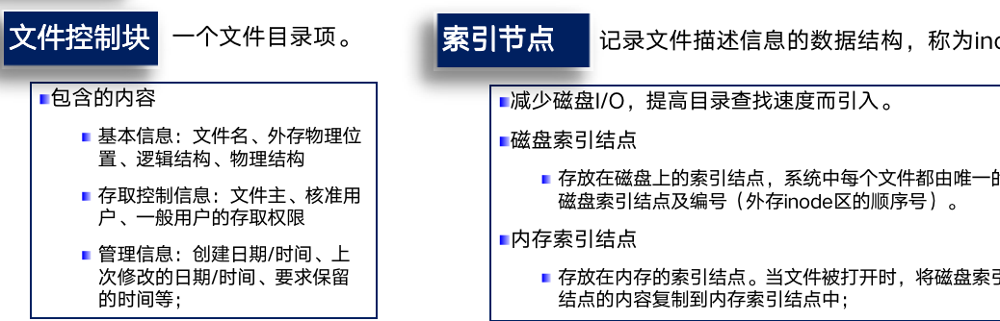


## 目录的实现

### 线性列表

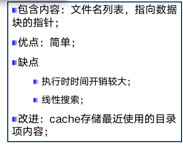

### 哈希表

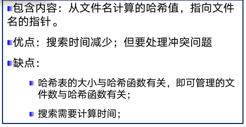

# 容错技术及性能改善

<font color='red'>不想看了，应该不多吧</font>

