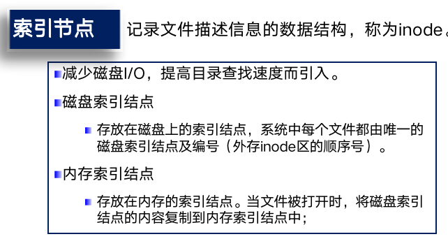
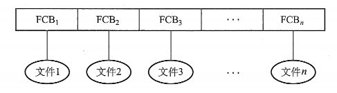
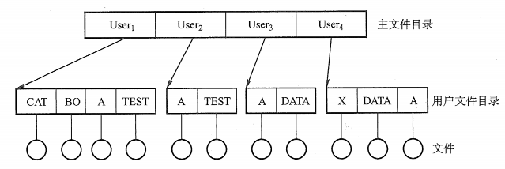
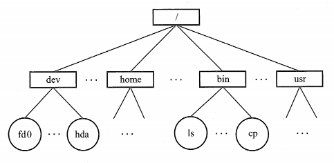
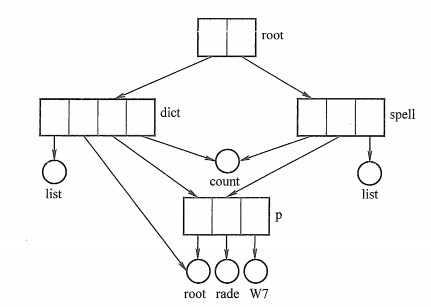
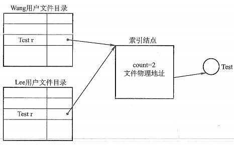
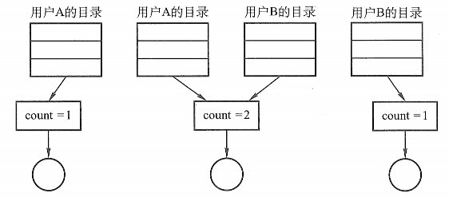
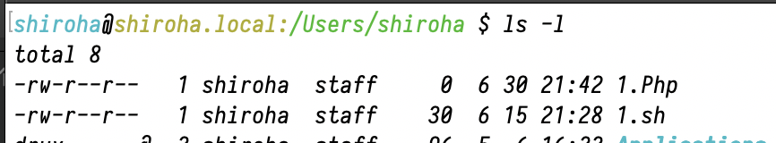

# 文件

## 文件的定义

```
文件是以计算机硬盘为载体的存储在计算机上的信息的集合。
在系统运行时，计算机以进程为基本单位进行资源的调度和分配；而在用户进行输入输出中，则以文件为基本单位。
```

## 文件的属性

-   名称。文件名称唯一，以容易读取的形式保存。
-   标识符。标示文件系统内文件的唯一标签，通常为数字，是对人不可读的一种内部名称。
-   类型。被支持不同类型的文件系统所使用。
-   位置。指向设备和设备文件的指针
-   大小。文件当前大小（用字节、字或块表示），也可以使用文件允许的最大值
-   保护。对文件进行保护的访问控制信息。
-   时间、日期和用户标识。文件创建、上次修改和上次访问的相关信息，便于追踪和跟踪文件的使用。

## 文件的基本操作

-   创建文件。
-   写文件。
-   读文件
-   文件重定位（文件寻址）
-   删除文件。
-   截断文件

## 文件类型

-   按用途分
    -   系统
    -   用户
    -   库文件
-   按存取控制属性
    -   只读文件
    -   读写文件
    -   只执行文件
-   按文件逻辑结构
    -   有结构
    -   无结构文件
-   按文件物理结构
    -   顺序
    -   链接
    -   索引文件
-   按文件中数据形式
    -   源文件
    -   目标文件
    -   可执行文件

## 访问方式

-   顺序访问
-   直接访问


# 目录

## 文件控制块和索引节点

与进程管理一样，为了实现目录管理，引入了文件控制块（FCB）的数据结构

### 文件控制块

文件控制块是用来存放控制文件秀要的各种信息的数据结构，以实现“按名存取”。FCB的有序集合称为文件目录，一个FCB就是一个文件目录项。

FCB包括以下信息：

-   基本信息。文件名，物理位置，逻辑结构，物理结构等。
-   存取控制信息。
-   使用信息。例如创建时间，修改日期等

### 索引节点

类似一个映射表吧，把文件名映射成一个索引节点编号，实现“按名查找”、允许重名



## 目录结构

### 对目录进行的操作

-   搜索。用户使用一个文件时，需要搜索目录，以找到相应的目录项
-   创建文件。当创建一个文件时，需要在目录中增加一个目录项
-   删除文件。
-   显示目录。用户可以请求显示目录的内容。
-   修改目录。

### 结构

#### 单级目录结构

在整个文件系统中只建立一张目录表，每个文件占一个目录项。



当访问文件时，

1.  按照文件名在该目录中找到相应的FCB
2.  经过合法性检查
3.  执行相应的操作


实现了“按名存取”，但是存在查找速度慢、文件不允许重名、不便于文件共享等缺点

#### 两级目录结构

单级目录很容易造成文件名称的混淆，因此采用两级方案。

将文件目录分为主文件目录（MFD），和用户文件目录（UFD）两级



主文件目录项记录用户名及相应用户文件目录所在的存储位置。用户文件目录项记录FCB信息，

#### 多级目录结构（树形目录结构）

将两级目录结构的层次关系加以推广，形成了多级目录结构



目录名和文件名用分隔号`/`连接而成，从根目录出发的路径称为绝对路径

#### 无环图目录结构

树形目录结构便于实现文件分类，但不便于实现文件共享，为此，在**树形目录结构的基础上**增加了一些指向同一节点的有向边



无环图目录结构方便的实现了文件的共享，但使得系统的管理变得更加复杂

优点： 

-   可共享；连接方式实现、复制文件信息
-   更灵活
-   遍历图相对简单

#### 通用目录结构

允许出现环

<font color='red'>应该不重要</font>

# 文件共享

多个用户（进程）共享同一份文件，系统只保存文件的一个副本。

## 基于索引节点的共享方式（硬连接）

在树形结构的目录中，当有两个或多个用户要共享一个字目录或文件时，必须将共享文件或者子目录链接到两个或多个目录的文件目录中



```
诸如文件的物理地址及其他的文件属性等信息，不再放在目录项中，而放在索引结点中。
在文件目录中只设置文件名及指向相应索引结点的指针.
索引结点中还应有一个链接计数count,用于表示链接到本索引结点（即文件）上的用户目录项的数目
```

```
用户A创建一个文件，count++;
用户B共享这个文件，count++;增加一个目录项，设置一个指针指向文件

用户A删掉文件（失败，因为count != 1），count--;
用户B删掉文件（成功），count--; count == 0;
```



## 利用符号链实现文件共享（软链接）

```
为了让用户B能够共享用户A的一个文件F，系统创建一个LINK类型的文件，也叫F，写入B的目录中，新文件只包含被链接文件F的路径名
这样的链接称为符号链接
```

```
删除共享文件之后，LINK文件访问失败，于是符号链接删除
但是会出现文件替换的问题（double use）

（题外话：在某个Linux训练靶场的联系机里面存在这样的题目。并且内核中也容易存在寄存器的double use）
```


# 文件保护

## 访问类型

-   读
-   写
-   执行
-   添加
-   删除
-   列表清单

## 访问控制

最常用的方法是根据用户身份进行控制。而实现基于身份访问的最为普通的方法是，为每个文件和目录增加一个访问控制列表（ACL），规定每个用户及其所允许的访问类型



优点：

-   可以使用复杂的访问方法

缺点：

-   长度无法预计
-   可能导致复杂的空间管理(使用精简的访问列表可以解决)

### 精简的访问列表

-   拥有者
-   组
-   其他

### 口令和密码


# 小结

-   文件是一个由操作系统定义和实现的抽象数据类型；文件系统是所有文件、目录的集合，操作系统一般采用层次型模型对文件系统进行管理；
-   对文件的访问由有两种方式，顺序访问和直接访问（随机访问）；
-   文件采用目录进行管理；
-   文件的共享和保护是非常重要的；