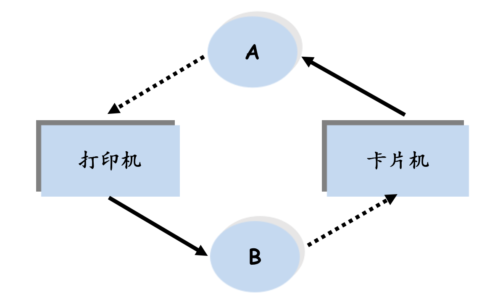
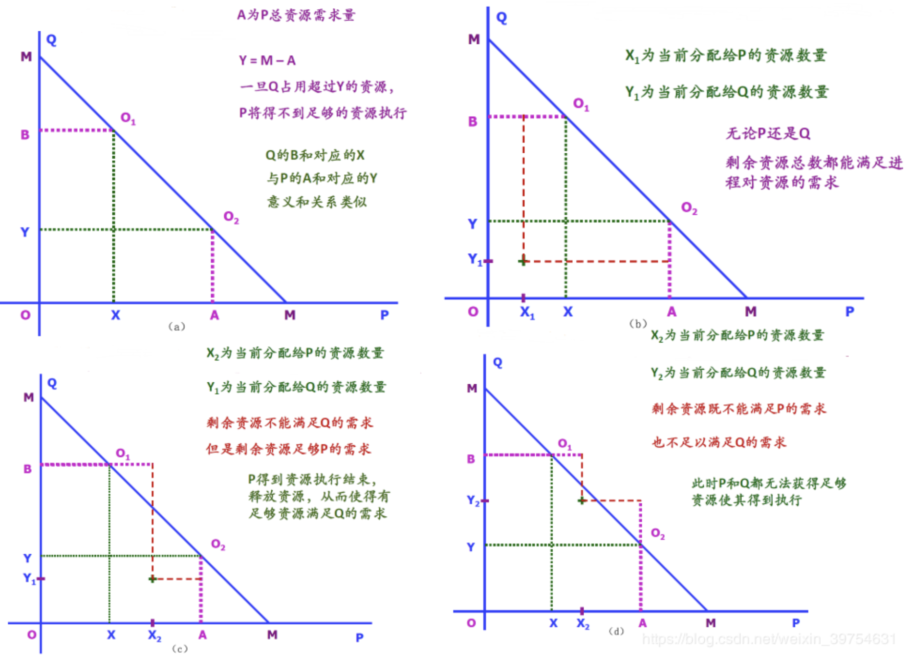
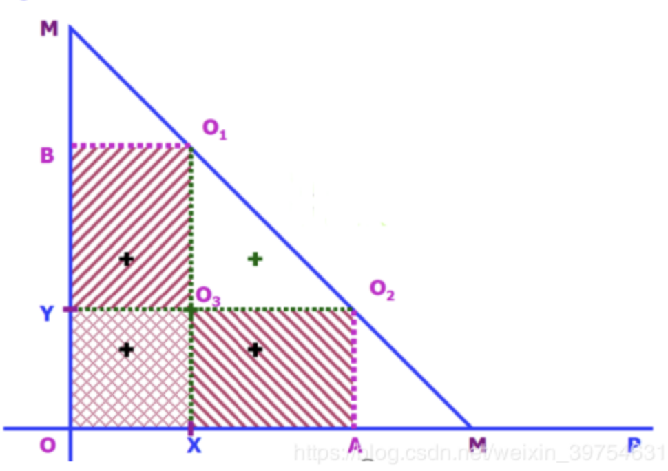
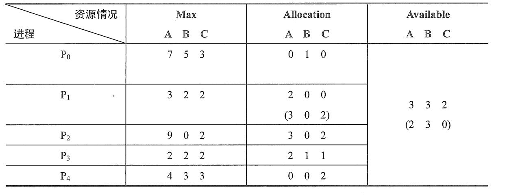
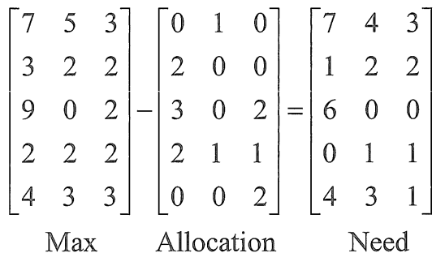
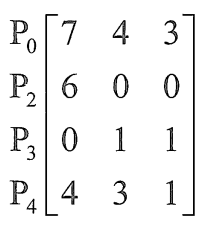
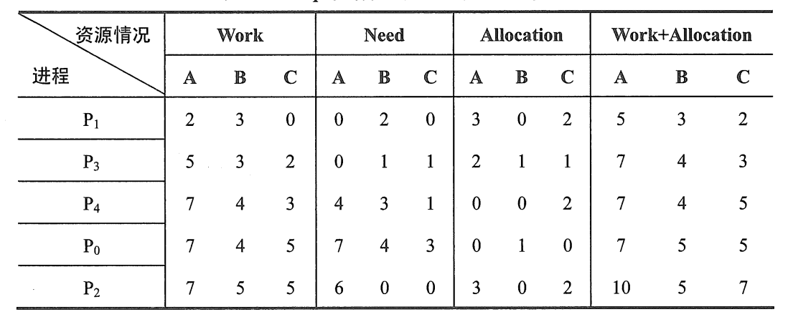
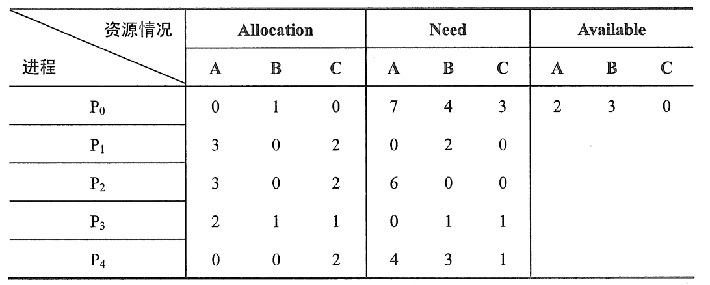

# 死锁

## 死锁的定义

```
在多道程序系统中，由于多个进程的并发执行，改善了系统资源的利用率并提高了系统 的处理能力。然而，多个进程的并发执行也带来了新的问题——死锁。所谓死锁是指多个进程因竞争资源而造成的一种僵局（互相等待），若无外力作用，这些进程都将无法向前推进。
```


## 举例

```
某计算机系统中只有一台打印机和一台输入设。
进程P1正占用输入设备，同时又提出使用打印机的请求
但此时打印机正被进程P2 所占用，而P2在未释放打印机之前，又提出请求使用正被P1占用着的输入设备。
这样两个进程相互无休止地等待下去，均无法继续执行，此时两个进程陷入死锁状态。
```


## 产生的原因

-   系统资源的竞争（资源数量不足）
-   进程推进顺序非法（就像上面那样）

### 必要条件

产生死锁必须同时满足以下四个条件，只要其中一个不成立，死锁就不会发生

-   互斥条件：某一段时间内某资源为一个进程占有，其他进程请求该资源只能等待
-   不可剥夺条件：资源在没有使用完毕之前**不能被强行夺走**，只能是主动释放。
-   请求和保持条件：进程已经保持了资源，提出了新的资源请求，该资源被其他进程占有，请求被阻塞，但是**对自己的资源不释放**
-   循环等待条件（环路等待）：存在一种进程资源的等待链：链中的每个进程已经获得的资源被下一个进程请求。



## 处理死锁的办法

-   不考虑死锁问题（鸵鸟算法，建国同志狂喜）
-   不让死锁发生
    -   [死锁预防](#死锁预防)
    -   [死锁避免](#死锁避免)
-   处理死锁
    -   死锁检测与解除


### 死锁预防

只要破坏四个条件之一，就能避免死锁

#### 破坏“互斥使用/资源独占”条件

资源本身的特性是独占的，是排他性使用的，所以要使用一种资源转换技术，把独占资源变为共享资源。例如针对于打印机，SPOOLing技术的引入解决不允许任何进程直接占有打印机的问题。设计一个“守护进程/线程”负责管理打印机，进程需要打印时，将请求发给该daemon，由它完成打印任务。

#### 破坏“占有且等待”条件

指一个进程占有了一部分资源，在申请其他资源的时候由于得不到满足而进入等待状态。有下面两种方案实现：

```
预先静态分配法：
	要求每个进程在运行前必须一次性申请它所要求的所有资源，且仅当该进程所要资源均可满足时才给予一次性分配。
	缺点： 资源的利用率很低
		  当一个进程所需要的资源不能同时满足的情况下可能一直处于等待状态，会产生饥饿现象。
```

```
动态分配法：
	在允许进程动态申请资源前提下规定，一个进程在申请新的资源不能立即得到满足而变为等待状态之前，必须释放已占有的全部资源，若需要再重新申请。
```

#### 破坏“不可抢占”条件

实现方案是当一个进程申请的资源被其他进程占用时，可以通过操作系统抢占这一资源(两个进程优先级不同)。这种方法具有局限性，适用于状态易于保存和恢复的资源，如CPU、内存资源。

#### 破坏“循环等待”条件

主要思想是通过定义资源类型的线性顺序实现，实现方案是资源有序分配法，把系统中所有资源编号，进程在申请资源时必须严格按资源编号的递增次序进行，否则操作系统不予分配。实现资源的有序分配时需要考虑如何对资源进行编号，通常可以利用资源使用的频繁性进行排序。

```
预先静态分配法：
	将系统中所有临界资源分配唯一的序号，进程严格按序号递增次序申请使用资源。
```


### 死锁避免

#### 例子

```
进程 P Q
资源 P->A Q->B
```

```
(b)中X1为进程P的资源占用量，Y1是Q进程的占有量，那么剩余的资源能满足P 或 Q进程对资源的需求量；
(c)中X2为进程P的资源占用量，Y1是Q进程的占有量，那么剩余的资源可以满足P进程对资源的最大需求量，等P进程释放资源后Q进程就可以继续执行，这时对资源的分配就是有条件的；
(d)中剩余资源既不能满足P进程也不能满足Q进程对资源的最大需求量。
```



```
具体分析：
	OXO3Y区域，P进程Q进程提出申请资源时操作系统都可以满足；
	XAO2O3区域内，如果P进程提出申请可以无条件满足，Q进程提出申请总数只要不超过Y就可以满足；同时操作系统应该控制不要让资源的申请分配出现在O1O2O3区域，否则系统剩余的资源数量既不能满足P进程也不能满足Q进程，会导致死锁。
```



#### 银行家算法

 ```
银行家算法是最著名的死锁避免算法，其思想是：
	把操作系统视为银行家，操作系统管理的资源相当于银行家管理的资金，进程向操作系统请求分配资源相当于用户向银行家贷款。操作系统按照银行家制定的规则为进程分配资源。
	进程运行之前先声明对各种资源的最大需求量，当进程在执行中继续申请资源时，先测试该进程已占用的资源数与本次申请的资源数之和是否超过该进程声明的最大需求量。
	若超过则拒绝分配资源，若未超过则再测试系统现存的资源能否满足该进程尚需的最大资源量，若能满足则按当前的申请量分配资源，否则也要推退分配。
 ```

-   最大需求矩阵Max：标示进程i 对 资源j 的最大需求
-   分配矩阵Allocation：进程i 已经分配到的 资源j 的数量
-   需求矩阵Need：进程i 接下来对 资源j 的最大需求

`Max - Allocation = Need`


```python
# Request[i][j] = k -> 进程Pi 申请 资源j k个
# Available[j] -> 系统 还剩资源j 的数量
if (Request[i][j] <= Need[i][j]):								# 申请的资源，超过了还能拿到的。
    if (Request[i][j] <= Available[j]):							# 申请的，超出了系统现在有的。
        Available[j] = Available[j] - Request[i][j]				# 把资源拟分配。
        Allocation[i][j] = Allocation[i][j] + Request[i][j]
        Need[i][j] = Need[i][j] - Request[i][j]
	else :
        p[i].wait()
   	if (os.isSafty()) :											# 系统执行安全性算法
        Allocate()												# 正式分配资源
    else :
        giveUp()												# 放弃此次分配
        p[i].wait()
```

#### 安全性算法

```
设置工作向量Work,有例个元素，表示系统中的剩余可用资源数目。
	在执行安全性算法开始时，Work=Available
	①初始时安全序列为空。
	②从Need矩阵中找出符合下面条件的行：该行对应的进程不在安全序列中，而且该行 <= Work向量，找到后，把对应的进程加入安全序列；若找不到，则执行步骤④。
	③进程P,进入安全序列后，可顺利执行，直至完成，并释放分配给它的资源，因此应执行Work = Work + Allocation]d,其中 Allocation^表示进程 E 代表的在 Allocation 矩阵中对应的行，返回步骤②。
	④若此时安全序列中已有所有进程，则系统处于安全状态，否则系统处于不安全状态。
```

##### 举例：

```
假定系统中有 5 个进程{P0, P1, P2, P3, P4} 和三类资源 {A, B, C}， 数量分别为 {10, 5, 7} 
```

T0时刻分配表



`work = Available = {3, 3, 2}`

1.  计算`Need矩阵`

    

2.  `work向量`和`Need向量`中的各行进行比较，找出比`work矩阵`**小**的行

    ```
    (3, 3, 2) > (1, 2, 2)
    (3, 3, 2) > (0, 1, 1)
    ```

    对应的两个进程分别为 P1和P3，选择P1（也可以是P3）暂时加入安全队列

3.  释放P1所占的资源，即**把P1进程对应的Allocation 矩阵中的一行与work向量相加**

    ```
    (3, 2, 2) + (2, 0, 0) = (5, 3, 2) = work
    ```

    更新矩阵为（去掉了P1）

    

4.  使用更新的work向量和矩阵重复步骤2。最后得到一个安全序列 {P1, P3, P4, P2, P0}（根据去掉的先后顺序）

    


##### 银行家算法举例

1.  P1请求资源，发出请求向量 Request[1] = {1, 0, 2}，系统按照银行家算法检查

    ```
    Request[1] = {1, 0, 2} <= Need[1] = {1, 2, 2}
    Request[1] = {1, 0, 2} <= Available[1] = {3, 3, 2}
    ```

    修改表项`Available` `Allocation` `Need`

    根据安全性算法检查是否安全，得到表

    

    根据这个检查得知，可找到一个安全序列 {P1, P3, P4, P2, P0}，所以，是安全的，可以立即分配资源，并且更新表

2.  P4请求资源 (3, 3, 0)，不够分配，让他等待

3.  P0请求资源 (0, 2, 0)，分配之后得不到安全序列，放弃分配，让他等待

    


