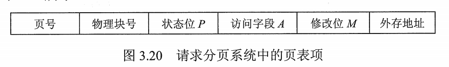
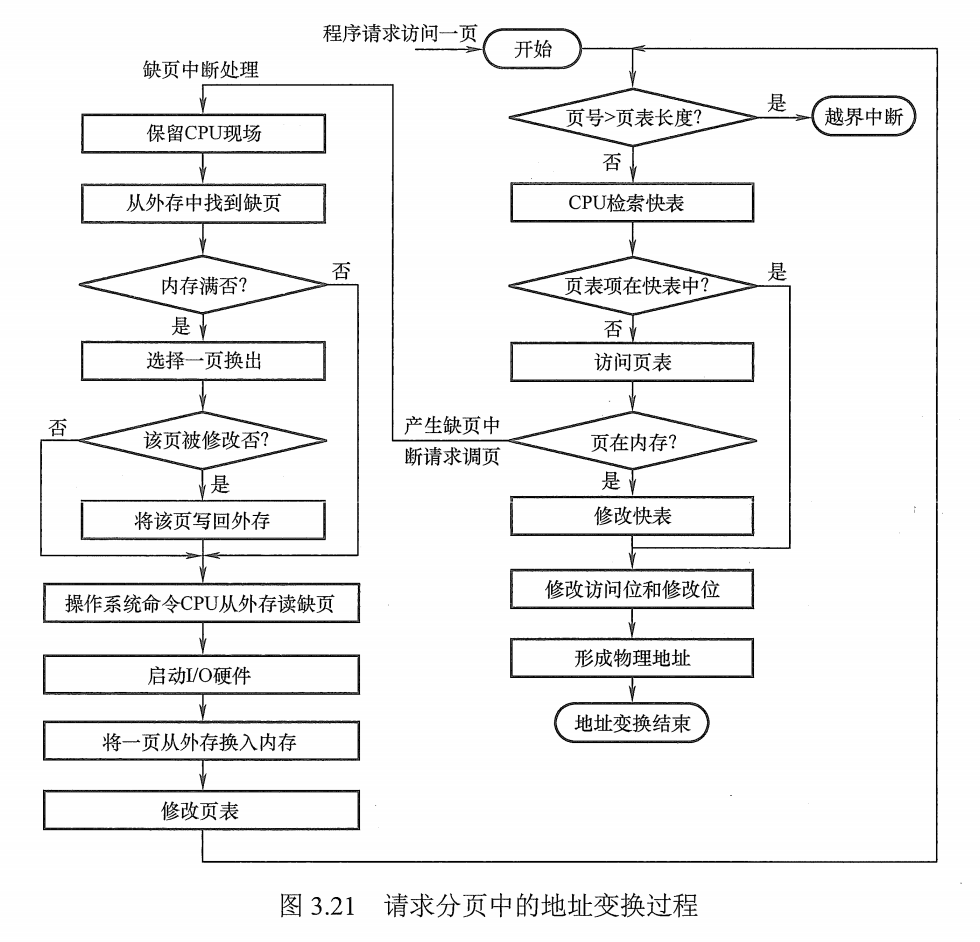
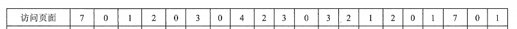
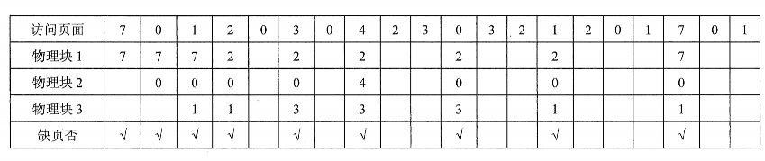
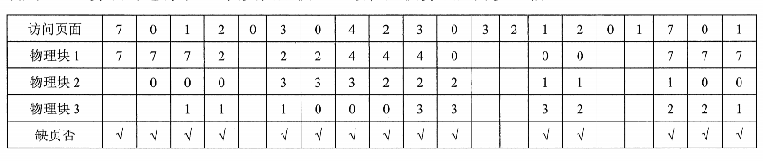
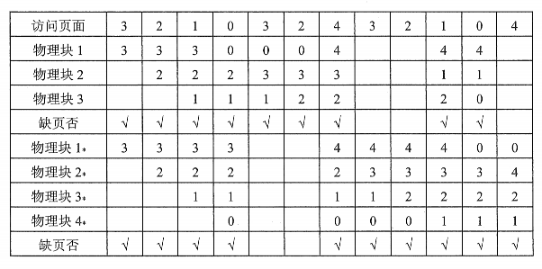
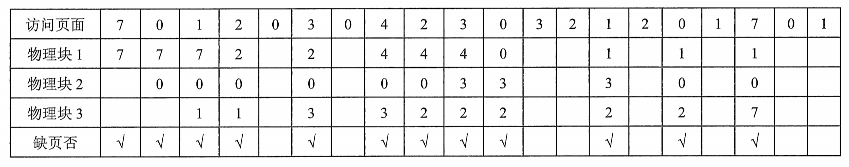
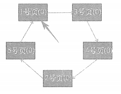
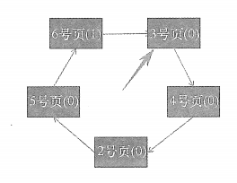

# 虚存管理

## 虚存管理的基本概念

### 传统存储管理方式的特征

1.  一次性。作业必须一次性全部装入内存才能开始运行。
    1.  当作业很大不能装入内存时，该作业无法运行；
    2.  当大量作业要求运行时，由于内存不足以容纳所有作业，只能使少数作业先运行，导致多道程序度的下降
2.  驻留性。作业被装入内存后，就一直驻留在内存中，不会被换出。

### 局部性原理

-   时间局部性。

    程序中的某一条指令一旦执行，不久后改指令可能再次执行；某数据被访问后，不久可能再次访问。产生时间局部性典型原因是**存在大量的循环操作**

-   空间局部性。

    一旦访问了某个存储单元，在不久后，其附近的存储单元也将被访问，即**程序在一段时间内所访问的地址可能集中在一定的范围内**

### 虚拟存储器的定义和特征

#### 定义

```
基于局部性原理，在程序装入时，将程序的一部分装入内存，而将其余部分留在外存，就可启动程序执行。
在程序执行过程中，当所访问的信息不在内存时，由操作系统将所需要的部分调入内存，然后继续执行程序。
另一方面，操作系统将内存中暂时不使用的内容换出到外存上，从而腾出空间存放将要调入内存的信息。
这样，系统好像为用户提供了一个比实际内存大得多的存储器，称为虚拟存储器。
```

#### 特征

-   多次性。

    多次性是指无需在作业运行时一次性全部装入内存，而允许被分成多次调入内存运行。

-   对换性。

    对换性是指无需在作业运行时一直常驻内存，而允许在作业运行过程中，进行换进和换出

-   虚拟性。

    虚拟性是指从逻辑上扩充内存的容量，使用户看到的内存容量远大于实际的内存容量

实现有三种方式：

-   请求分页存储管理
-   请求分段存储管理
-   请求段页式存储管理


## 请求分页管理方式

建立在**基本分页系统**上。为了实现请求分页系统必须提供一定的硬件支持，还需要有页表机制、缺页中断、地址变换机构

### 页表机制

页表项



增加了四个字段：

-   状态位p。用于标志该页是否已经调入内存，供**程序访问时**参考。
-   访问字段A。用于记录本页在一段时间内被访问的次数，或者多长时间没有被访问，供**页面置换算法**参考。
-   修改位M。标志该页在调入内存后是否被修改过。
-   外存地址。用于指出该页在外存上的地址，通常是物理块号供**调入该页时**参考。

### 缺页中断机构

在请求分页系统中，每当所要访问的页面不在内存中时，便产生一个缺页中断，请求操作系统将所缺的页调入内存。此时应将缺页的进程阻塞（调页完成之后唤醒）


### 地址变换机构

过程：

​	

-   先检索快表
    -   若找到要访问的页，修改页表的访问位（修改位），然后利用页表项中给出的物理块号和业内地址形成物理地址
    -   若未找到该页的页表项，则应到**内存**中去查找页表，再对比页表项中的状态位P，看该页是否已经调入内存，未调入则产生缺页中断，请求从外存把该页调入内存。
-   到内存中去查找**页表**

## 页面置换算法

-   [最佳(OPT)置换算法](#最佳(OPT)置换算法)
-   [先进先出(FIFO)置换算法](#先进先出(FIFO)置换算法)
-   [最久未使用(LRU)置换算法](#最久未使用(LRU)置换算法)
-   [时钟(CLOCK)置换算法](#时钟(CLOCK)置换算法)
-   [最少使用(LFU)置换算法](#最少使用(LFU)置换算法)
-   [最多使用(MFU)置换算法](#最多使用(MFU)置换算法)

### 最佳(OPT)置换算法

#### 算法

```
最佳置换算法选择的被淘汰的页面是以后永不使用的页面，或者是最长时间内不被访问的页面，以便保证获得最低的缺页率。
然而，由于人们目前无法预知，因而该算法无法实现。
```

#### 举例

```
假定系统为某进程分配了 **三个物理块**， 并考虑有页面号应用串
7, 0, 1, 2, 0, 3, 0, 4, 2, 3, 0, 3, 2, 1, 2, 0, 1, 7, 0, 1
如下图所示
```



进程运行时，

1.  将`7 0 1`三个页面依次装入内存。

2.  访问`2`时，产生缺页中断，根据最佳置换算法，选择最远被访问的7，淘汰。

3.  访问`0`，存在，不产生中断。

4.  。。。

5.  最后的置换图如下

    

>   没有填的那一列的物理块和前一个相同。

### 先进先出(FIFO)置换算法

#### 算法

```
优先淘汰掉最早进入内存的页面，
就像是一个队列，满了就把最先前的“挤出去”了。
该算法与进程实际运行时的规律不适应，因为在进程中，有的页面经常被访问
```

#### 举例

还是上面例子中的条件

采用FIFO算法的过程：

1.  `7 0 1`进入内存

2.  访问`2`时，产生缺页中断，将`7`置换

3.  访问`0`时存在，不产生中断。

4.  ......

5.  过程如图

    


#### Belady现象

FIFO算法还会因为物理块增多而页故障数不减反增的异常现象。称为Belady现象。只有FIFO才会出现。

当分配物理块为3时，下面的例子缺页次数为9次，分配为4时，缺页为10次。



### 最久未使用(LRU)置换算法

#### 算法

```
选择最近最长时间没有访问过的页面予以淘汰
他认为过去一段时间未访问到的页面在最近的将来可能也不访问。
```

#### 举例

还是那个例子



>   LRU算法的性能较好，但需要寄存器和栈的硬件支持
>
>   LRU是堆栈类算法。
>
>   堆栈类算法不可能出现Belady现象。

### 时钟(CLOCK)置换算法

又称**最近未使用**算法

#### 简单的clock

```
增加了一个使用位u，当页面被访问到的时候，将u置为1
尽可能留下访问过的页面，淘汰未使用过的页面
```

```
当需要换页时，扫描缓冲区，查找使用位为0的页面，遇到的第一个就拿来替换；
并且把查找访问到的使用位为1的页面，都写成0
一次找不到那就再找一次。
```

#### 举例

```
访问顺序 1, 3, 4, 2, 5
而后访问 6
```

访问6 之前的缓冲区。



1.  第一轮扫描，指针扫过的使用位均设置为0，未找到本来使用位就是0的页面

2.  第二轮扫描，1页面的使用位为1，将1页面换出，6 页面移入，6页面使用位设置为1，指针后移

    

#### 改进型clock

```
在简单clock的基础上，增加了一个修改位m，用来表示是否已经修改过。
1. 没有被访问，也没有被修改。u = m = 0;
2. 没有被访问，却被修改。 u = 0; m = 1;
3. 被访问了，没有修改。 u = 1; m = 0;
4. 被访问了，也被修改了。 u = 1; m = 1;
```

```
1. 从指针的当前位置开始，扫描缓冲区。对使用位不做修改，只是查找 u = m = 0;的帧用于替换。
2. 若步骤1 没有找到，重新扫描，查找 u = 0, m = 1;的帧。选择遇到的第一个帧用于替换。在这个过程中，跳过的每个帧，使用位设置为0
3. 若步骤2 失败，指针回到最初的位置，且集合中所有的使用位均为0。 重复步骤1，如果有必要，重复步骤2。
```

### 最少使用(LFU)置换算法

```
最近使用次数少的页面淘汰。
```

### 最多使用(MFU)置换算法

```
最近使用最多的页面淘汰
```

### 算法的比较

-   FIFIO 算法实现简单，但是性能差
-   LRU 算法性能接近OPT算法，但实现困难，开销大

### 缺页率和有效访问时间

```
缺页率p
有效访问时间 EAT
EAT = (1 - p) * 内存访问时间 + p * 缺页中断时间（缺页中断服务时间 + 页面置换出去的时间 + 缺页读如时间 + 进程恢复执行时间）
```


## 页面分配策略

### 驻留集大小

```
给一个进程分配的物理页框的集合就是这个进程的驻留集
```

-   分配给一个进程的存储量越小，任何时候驻留在主存中的进程就越多

<font color = 'red'>不想写了，不是很重点的样子</font>


## 抖动

```
在页面置换的过程中，刚刚换出的页面马上又要换入主存，刚刚换入的页面，马上又要换出主存，这样频繁的页面调度行为称为 抖动或颠簸

频繁发生缺页中断的主要原因是，某进程频繁访问的页面数目高于可用的物理页帧数亩。
```


## 请求分段

<font color='red'>不是很重点的样子</font>


## 总结

-   虚存是用户所看到的比实际更大的内存空间，是一种技术；特征包括有6个，虚存技术的实现需要硬件支持；
-   请求分页机制实现的硬件支持和分页机制的比较；
-   页面置换算法影响请求分页机制的缺页率，而缺页率影响有效访问时间；可能会带来抖动问题
-   抖动是系统需要考虑的问题，可以采用4种方法来预防抖动，包括工作集模型；
-   请求分段机制和分段机制的区别比较；