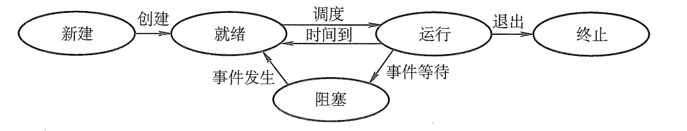
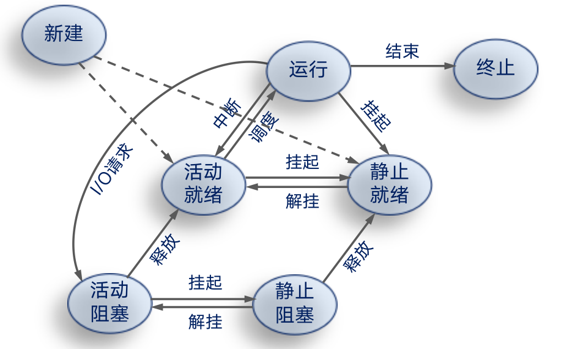
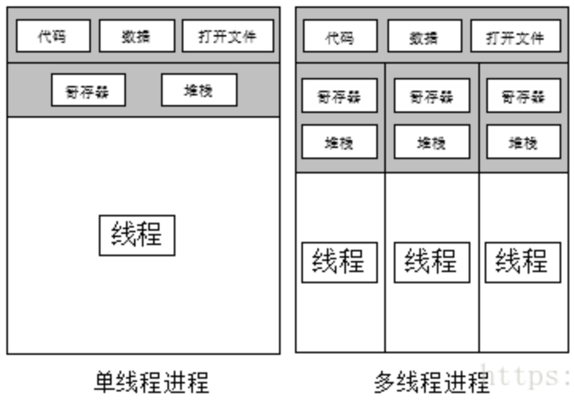

# 进程

## 进程的概念

进程是指一个具有一定`独立功能`的程序在一个`数据集合`上的一次`动态执行`过程。

用一个`进程控制块`[PCB](#PCB)来描述


## PCB

进程控制块是操作系统管理控制进程运行所用的信息集合。

### 作用：

-   操作系统用PCB来描述进程的基本情况以及运行变化的过程；
-   PCB是进程存在的唯一标志；
-   每个进程在操作系统中有一个对应的PCB

### 组成：

-   进程标识信息
-   处理器现场保存
-   进程控制信息
    -   调度和状态信息（调度进程和处理器使用情况）
    -   进程间通信信息（进程间通信相关的各种标识）
    -   存储管理信息（进程映像存储空间数据结构）
    -   进程所用资源（进程使用的系统资源，如打开文件等）
    -   有关数据结构连接信息（与PCB线管的进程队列）


## 进程的特征

-   [动态性](#动态性)
-   [并发性](#并发性)
-   [独立性](#独立性)
-   [异步性](#异步性)
-   [结构性](#结构性)

### 动态性

动态性是进程最基本的特征

进程是程序的一次执行，有一定的生命周期，是动态的产生、变化、消亡的。

### 并发性

多个进程尸体同时存在内存中，能在一段时间内同时运行。

并发是进程的重要特征，也是操作系统的重要特征。

为了提高资源利用率

### 独立性

进程之前互不干涉、互相独立

### 异步性

异步性会导致执行结果的不可再现性，所以需要进程同步机制

### 结构性


## 进程的状态与转换

### 创建态

进程创建的步骤：

1.  申请一个PCB
2.  填入相关的信息
3.  系统为其分配资源
4.  转入就绪态

### 就绪态

在就绪队列中，排到队了就运行

### 运行态

正在运行的状态，单处理机环境下，每个时刻最多只有一个进程处于运行态。

### 阻塞态

因为某事件暂停运行

### 结束态

进程从系统中消失，置其为结束态，回收资源和内存

进程终止的工作：

1.  找到PCB
2.  若其正在执行，终止
3.  撤销其所有子孙（子进程）
4.  回收所有资源，归还给父进程或系统
5.  将PCB移出队列

### 转换图



### 进程的挂起/解挂状态

加入了挂起和解挂状态的转换图如下：




# 线程

## 进程和线程的关系



线程是进程的一部分

```
进程 = 线程 + 共享资源
```


## 进程与线程的比较

1.  调度。

    1.  线程是`cpu调度`的单位，进程是`资源分配`的单位

    2.  同一进程中线程的切换，不会引起进程的切换

2.  并发性。

    1.  线程与线程可以并发执行
    2.  进程与进程可以并发执行

3.  拥有资源

    1.  线程共享进程的资源，自己只拥有运行指令执行必要的资源（堆栈等）

4.  系统开销

    1.  线程的开销远小于进程
    2.  线程容易实现通信和同步


# 总结

-   进程和线程是操作系统用于管理CPU资源的单位
-   PCB是进程管理中重要的数据结构
-   提高CPU利用率和资源利用率是操作系统追求的重要目标