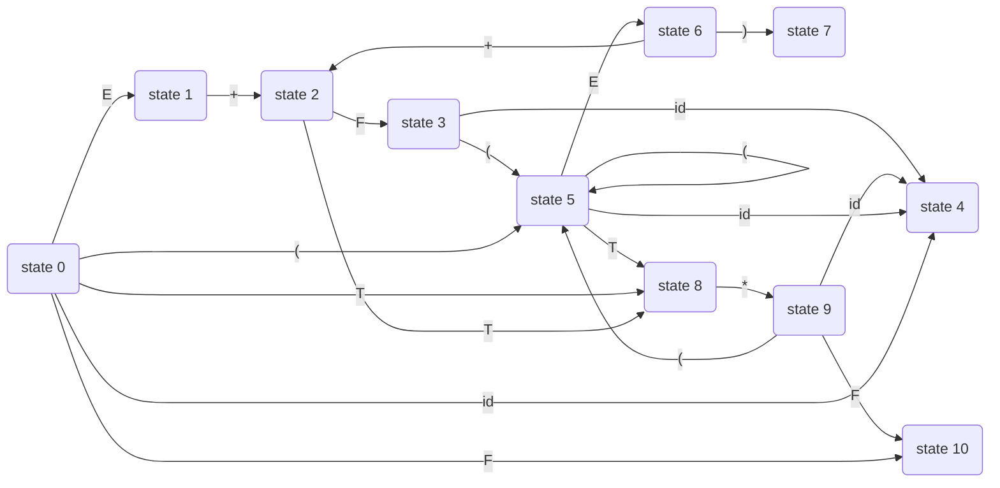

# 文法


```
S -> E  					I0
E -> E + T
E -> T
T -> T * F
T -> F
F -> (E)
F -> id
```


# LR分析表

## State 0

```
S -> .E
E -> .E + T
E -> .T
T -> .T * F
T -> .F
F -> .(E)
F -> .id
```


## State 1

```
S -> E.
E -> E. + T
```


## State 2

```
E -> E +. T
T -> .T * F
T -> .F
```


## State 3

```
T -> F.
```


## State 4

```
F -> id.
(ends)
```


## State 5

```
F -> (.E)
E -> .E + T
E -> .T 
T -> .T * F
T -> .F
F -> .(E)
F -> .id
```


## State 6

```
F -> (E.)
E -> E. + F
```


## state 7

```
F -> (E).
(ends)
```


## state 8

```
E -> T.
T -> T. * F
```


## STATE 9

```
T -> T * .F
F -> .id
F -> .(E)
```


## STATE 10

```
T -> T * F.
(ENDS)
```





| state | id   | +    | *    | (    | )    | $      | E    | T    | F    |
| ----- | ---- | ---- | ---- | ---- | ---- | ------ | ---- | ---- | ---- |
| s0    | s4   |      |      | s5   |      |        | 1    | 8    | 3    |
| S1    |      | S2   |      |      |      | Accept |      |      |      |
| S2    |      |      |      |      |      |        |      | 8    | 3    |
| s3    |      | r4   | r4   |      | r4   | r4     |      |      |      |
| s4    |      | r6   | r6   |      | r6   | r6     |      |      |      |
| S5    | s4   |      |      | s5   |      |        | 6    | 8    | 3    |
| s6    |      | s2   |      |      | s7   |        |      |      |      |
| s7    |      | r5   | r5   |      | r5   | r5     |      |      |      |
| s8    |      | r2   | s9   |      | r2   | r2     |      |      |      |
| s9    | s4   |      |      | s5   |      |        |      |      | 10   |
| S10   |      | r3   | r3   |      | r3   | r3     |      |      |      |


# LL分析表

## first

### 终结符

```c
first(+) = {+}
first(*) = {*}
first(() = {(}
first()) = {)}
first(id) = {id}
```


### 非终结符

```c
first(F) = {(, id}
first(T`) = {*, e}
first(T) = {(, id}
first(E`) = {+, e}
first(E) = {(, id}
```


## follow

```
follow(E) = {), $}
follow(E`) = {), $}
follow(T) = {+, ), $}
follow(T`) = {+, ), $}
follow(F) = {*, +, ), $}
```


| 变量 | id     | +         | *         | (      | )      | $      |
| ---- | ------ | --------- | --------- | ------ | ------ | ------ |
| E    | E->TE` |           |           | E->TE` |        |        |
| E`   |        | E\`->+TE` |           |        | E\`->e | E\`->e |
| T    | T->FT` |           |           | T->FT` |        |        |
| T`   |        | T`->e     | T\`->*FT` |        | T`->e  | T`->e  |
| F    | F->id  |           |           | F->(E) |        |        |


