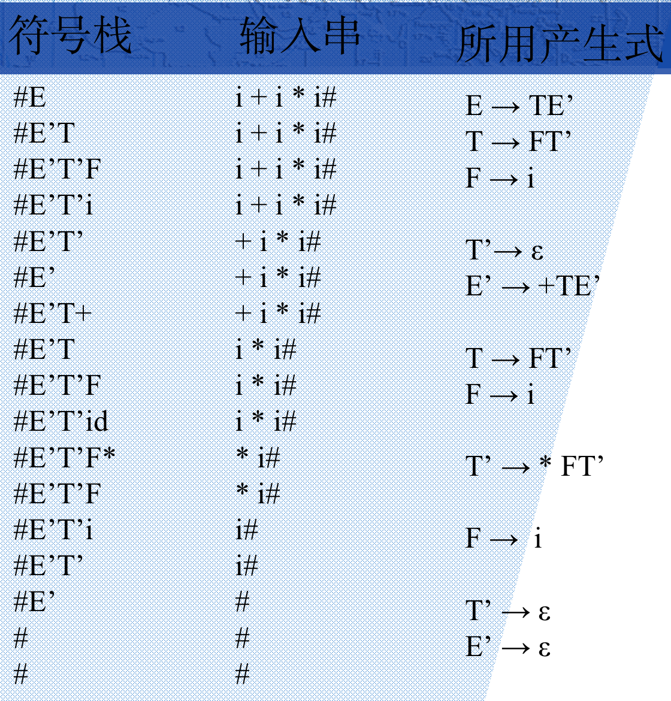

# LL(1)分析法

## #define

```c
#define a α
#define b β
#define e ε
#define null Ø
```


## 充要条件

一个文法是LL文法的充要条件

```
一个文法G是LL(1)的，当且仅当对于G的每一个非终结符Ａ的任何两个不同产生式Ａ→α | β，下面的条件成立：
１.FIRST(α)∩FIRST(β)= null；
２.假若β =*> e，那么，FIRST(α)∩FOLLOW(A)＝ null。
LL(1)文法是无二义的．
```


## 消除左递归

### 左递归

```
直接左递归：
		A -> Aa | b

间接左递归：
		A -> aB
		A -> Bb
		B -> Ac
		B -> d
```


### 消除方法

#### 直接左递归

```
A -> Aa | b

A -> bA' 
A' -> aA'
```


#### 间接左递归

```
先变成直接左递归的形式：
    B -> Ac -> aBc
    B -> Ac -> Bbc
    B -> d
		即 B -> aBc | Bbc | d
	
消除直接左递归:
		B -> dB' | aBcB'
		B' -> bcB'
```


## 提取左因子

类似于提取公因式

```
S → aB1|aB2|aB3|aB4|...|aBn|y

S → aS'|y
S'→ B1|B2|B3|...|Bn
```


## First集、Follow集


### First集构造方法

```
A -> aB | CD
这里面包含了组成First（A）的两种情况：
           以终结符开头，，		把这个终结符放到A的First里
           以非终结符开头，		把C的First放到A的First里，如果C的First中有 e 的话就把D的First放到A的First里，如果D也有空的话往后依次类推
技巧：First一般从下往上找。
           如果要找A的First，我们要找A的定义式，即A在左边的式子，看着他的右边来找。
```


### Follow集构造方法

```
S->(L) | aL | LC   
找Follow的三种情况：先在候选式（右边）中找到该非终结符，如L（注意例中只有一个定义，但找Follow要看到所有右边出现该非终结符的）
           如果L的右边是终结符，    		那么这个终结符加入L的Follow
           如果L的右边是非终结符 			那么把这个非终结符的 First 除去 e 加到 L的Follow中
           如果L处在末尾，               那么，'->' 左边符号(S) 的Follow 成为 L的Follow

另外要注意的是：
           开始符号S 的Follow中要加上 ‘#’        
技巧：Follow一般从上往下找。
           如果要找L的Follow，要从式子的右边找到L，然后来找L的Follow，这与First是不同的。
```


## 表的构造方法

```
对于文法G的每个产生式 A->α ，进行如下处理: 
	1. 对于FIRST(α)中每个终结符号a，将 A->α 加入到 M[A,a] 中。
	2. 如果 e 在FIRST(α)中，那么对于FOLLOW(A)中每个终结符号b，将 A->α 加入到 M[A,b] 中。如果 ε在FIRST(α)，且$在FOLLOW(A)中，也将 A->α 加入到 M[A,$] 中。
```


### 实例

#### 文法

```
E -> TE'
E' -> +TE' | e
T -> FT'
T' -> *FT' | e
F -> (E) | id
```


#### 集

```
FIRST(E) = FIRST(T) = FIRST(F) = { ( , id }
FIRST(E') = FIRST(+) ∪ FIRST(ε)= { + ,  e }
FIRST(T') = FIRST(*) ∪ FIRST(ε)= { * ,  e }
FOLLOW(E) = FOLLOW(E') = { ) , $ }
FOLLOW(T) = FOLLOW(T') = { + , ) , $ }
FOLLOW(F) = { * , + , ) , $ }
```


#### 填表

1.  根据规则 1 填入（例如 `E -> TE'` ，对于`first(T) = {id, (}`，将 `E -> TE'`写入 `M[E, id] M[E, (]` 中）

    分析法.assets/image-20200625152254761.png)

2.  根据规则 2 填入（例如`E' -> e`，e在`first(e) = {e}` 中，对于`follow(E') = {), $}`，将`E->e`写入`M[E', )] M[E', $]`

    分析法.assets/image-20200625152319727.png)


## 分析过程

举例 `i + i * i`



