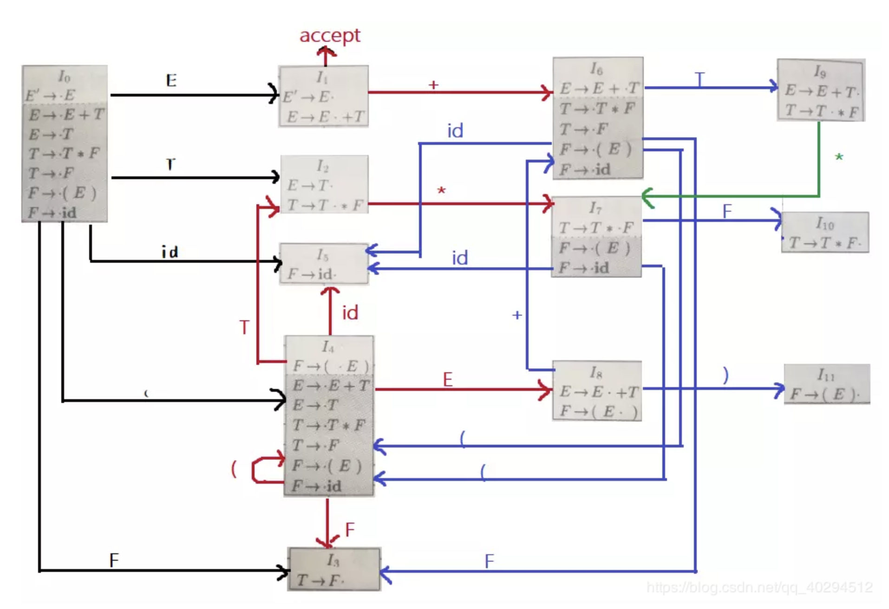
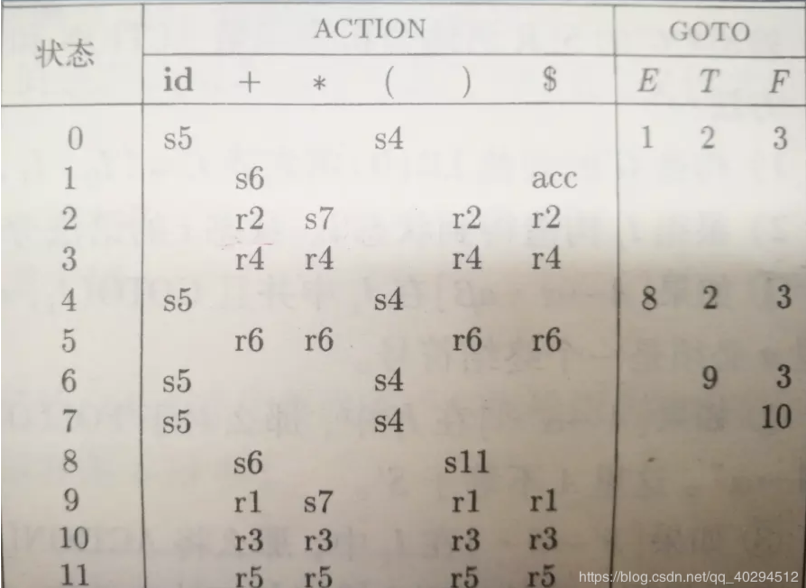

# LR分析法


## #define

```

```


## 组成规则

语法分析表由两部分组成，一个语法分析动作函数`ACTION`和一个转换函数`GOTO`

### Action函数

```
ACTION函数有两个参数：一个是状态i，另一个是终结符号a（或是输入标记符号$），ACTION[i,a]有四种形式:
    1. 移入j，j是一个状态
    2. 归约A->β
    3. 接受
    4. 报错

构建表示，我们约定：
    1. si表示移入并将状态i压栈
    2. rj表示按照编号j的产生式归约
    3. acc表示接受
    4. 空白表示报错
```


### Goto函数

```
我们把定义在项集上的GOTO函数拓展为定义在状态集上的函数：
	1. 如果GOTO[Ii,A] = Ii，那么GOTO也把状态i和一个非终结符号A映射到状态j。
```


## 示例

### 文法

```
E -> E+T 
E -> T
T -> T*F 
T -> F
F -> (E) 
F -> id
```


### 构建自动机

**[我的github](https://github.com/ethushiroha/Complie)上面有构造的过程（可能存在些许错误）**，构造的结果如下




### 构建语法分析表

假设已构造出LR(0)项目集规范族为：C={I0,I1, … , In}，其中Ik为项目集的名字，k为状态名，令包含S′→·S项目的集合Ik的下标k为分析器的初始状态。

**I0,I1分别对应上面图中的I0，I1**


#### SLR构造

```
构造方法：
	① 若项目A→α·aβ属于Ik且转换函数GOTO(Ik,a)= Ij，当a为终结符时则置ACTION[k,a]为Sj。　
　　② 若项目A→α· 属于Ik，则对 Follow(A)中的所有a 和’#'号 置ACTION[k,a]和ACTION[k,#]为”rj”，j为在文法G′中某产生式A→α的序号。
　　③ 若GO(Ik,A)＝Ij，则置GOTO[k,A]为”j”，其中A为非终结符。　
　　④ 若项目S′→S·属于Ik，则置ACTION[k,#]为”acc”，表示接受。
　　⑤ 凡不能用上述方法填入的分析表的元素，均应填上”报错标志”。为了表的清晰我们仅用空白表示错误标志。
```

<font color='red'>注意：是对于 Follow(A)中的a 和 '#'</font>

构造后的结果




#### LR(0)构造

```
构造过程如下：
　　① 若项目A→α·aβ属于Ik且转换函数GOTO(Ik,a)= Ij，当a为终结符时则置ACTION[k,a]为Sj。　
　　② 若项目A→α· 属于Ik，则对任何终结符a 和’#'号置ACTION[k,a]和ACTION[k,#]为”rj”，j为在文法G′中某产生式A→α的序号。
　　③ 若GO(Ik,A)＝Ij，则置GOTO[k,A]为”j”，其中A为非终结符。　
　　④ 若项目S′→S·属于Ik，则置ACTION[k,#]为”acc”，表示接受。
　　⑤ 凡不能用上述方法填入的分析表的元素，均应填上”报错标志”。为了表的清晰我们仅用空白表示错误标志。
```

<font color='red'>注意：是对于任何终结符 和 '#'</font>

构造后的结果即`在上图有规约的那一行对所有的非终结符补充r规约`


#### 二者的区别

[LL LR SLR LALR 傻傻分不清](https://www.cnblogs.com/yongzhewudi/p/6048301.html)

[编译原理之LL(1) 、LR(0)、SLR、LR(1)、LALR文法的对比](https://blog.csdn.net/zuzhiang/article/details/79047743)

