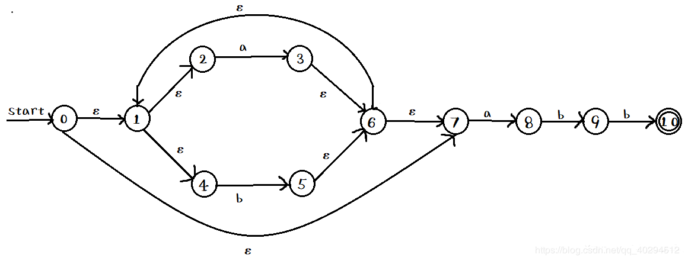
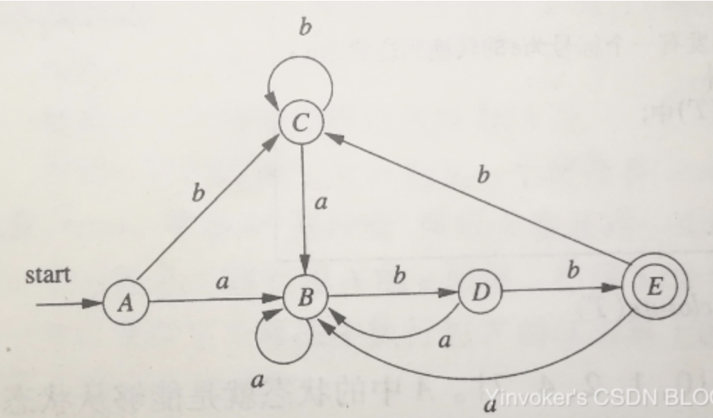
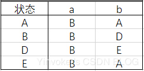
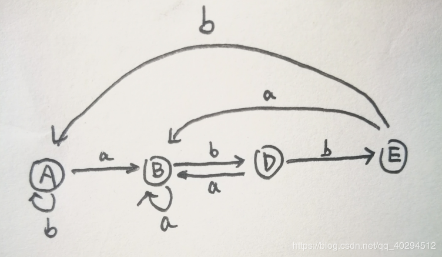

# NFA到DFA转换与DFA优化

<font color='red'>参考资料</font>: <a href>https://blog.csdn.net/qq_40294512/article/details/89004777</a>

## #define

```
#define e ε
```


## NFA和DFA

```
NFA: 不确定有限自动机
DFA: 确定有限自动机
```

### 区别

1. DFA任何状态都没有ε转换，即没有任何状态可以不进行输入符号的匹配就直接进入下一个状态；
2. DFA对任何状态s和任何输入符号a，最多只有一条标记为a的边离开s，即转换函数δ：S Σ S是一个单值部分函数。
3. DFA的初态唯一，NFA的初态为一集合。


### 操作

```html
e-closure(s): 从 NFA的状态 s 出发， 只通过 e 转换到 NFA状态 的集合
e-closure(T): 从 T集合 出发， 只通过 e 转换到 NFA状态 的集合
move(T, a): 从 T集合 出发， 通过状态 a(e) 转换到 NFA状态 的集合
```


### 举例

#### NFA状态图




#### 转换过程

1. 构建一个表

   | NFA  | DFA  | a    | b    |
   | ---- | ---- | ---- | ---- |
   |      |      |      |      |
   |      |      |      |      |
   |      |      |      |      |

2.  做`e-closure(s)`，得到一个集合`{0, 1, 2, 4, 7}`，标志DFA状态为A

   | NFA             | DFA  | a    | b    |
   | --------------- | ---- | ---- | ---- |
   | {0, 1, 2, 4, 7} | A    |      |      |
   |                 |      |      |      |
   |                 |      |      |      |

3. 做`move(A, a)`，得到一个集合`{1, 2, 3, 4, 6, 7, 8}`，标志DFA状态为B

   | NFA                   | DFA  | a    | b    |
   | --------------------- | ---- | ---- | ---- |
   | {0, 1, 2, 4, 7}       | A    | B    |      |
   | {1, 2, 3, 4, 6, 7, 8} | B    |      |      |
   |                       |      |      |      |

4. 做`move(A, b)`，并重复上述动作，直到没有新状态产生，且表格填满

   | NFA                    | DFA  | a    | b    |
   | ---------------------- | ---- | ---- | ---- |
   | {0, 1, 2, 4, 7}        | A    | B    | C    |
   | {1, 2, 3, 4, 6, 7, 8}  | B    | B    | D    |
   | {1, 2, 4, 5, 6, 7}     | C    | B    | C    |
   | {1, 2, 4, 5, 6, 7, 9}  | D    | B    | E    |
   | {1, 2, 4, 5, 6, 7, 10} | E    | B    | C    |

5. 转化为DFA图

   


## DFA优化

### 操作过程

1. 将得到的状态进行划分，划分为两部分，一部分为接收态，一部分为为非接收态组。
2. 继续进行划分，通过其可以匹配的字符进行判断，若该组内所有成员匹配字符都落在同一组内，即不可再分，否则重新划分组
3. 若产生不了新的分组，则进入步骤4，否则返回2
4. 每个组中选取一个状态作为代表，代表DFA的最简状态。


### 举例

使用上面的例子作为实例

1. 分组，得到{A, B, C, D}{E}

2. 对分组{A, B, C, D} 做a转换，发现都在分组内；做b转换，D转换后的结果不在组内，所以产生{A, B ,C}{D}{E}

3. 对分组{A, B, C} 做上述转换得到{A, C}{B}{D}{E}

4. 3中的分组无法再分

5. 得到转换表

   

   

6. 画出转换图

   

   


