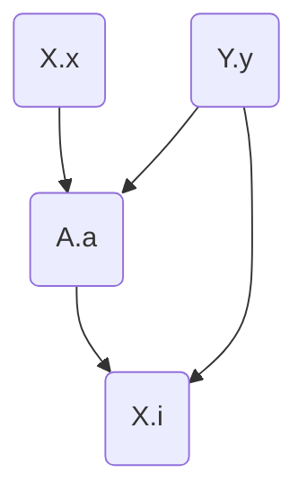
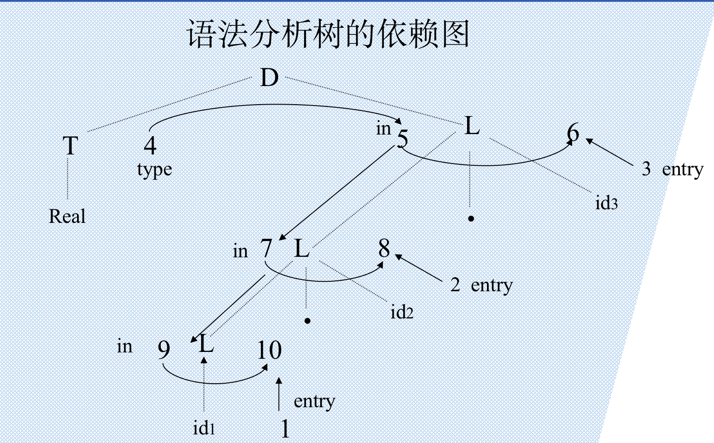
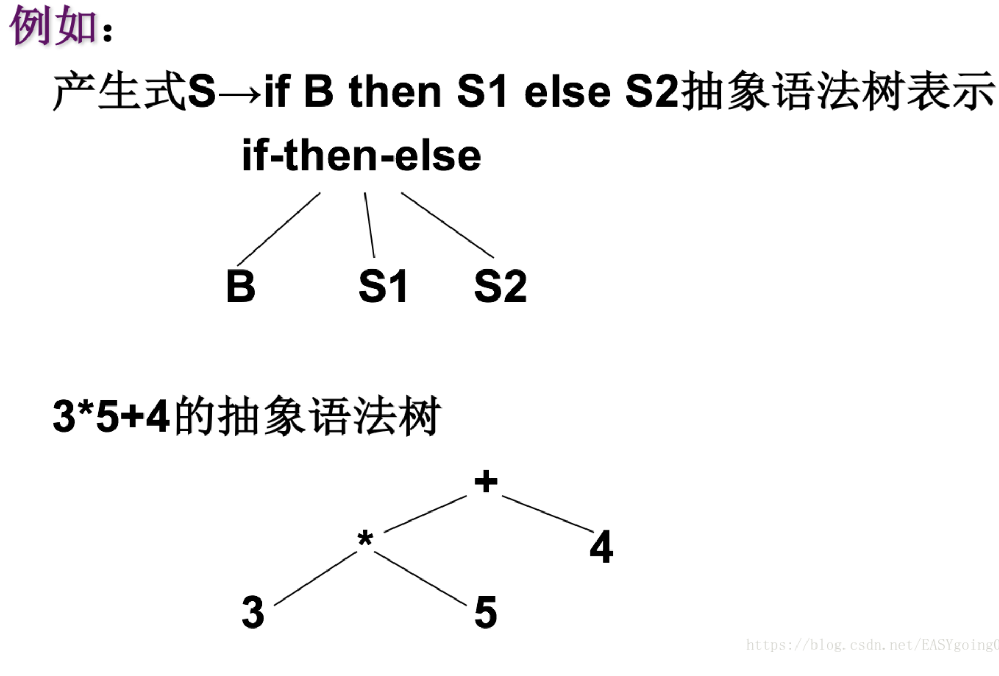

# 属性文法和语法制导翻译


## #define

```c

```


## 综合属性和继承属性

都是对于语法树而言的

### 综合属性

```
用于“自下而上”传递信息
	在语法树中，一个结点的综合属性的值，由其子结点的属性值确定
```

<font color='red'>各个分支联系起来就是全部 的意思？</font>


### 继承属性

```
用于“自上而下”传递信息。
	在语法树中，一个结点的继承属性由此结点的父结点和/或兄弟结点的
	某些属性确定
```

<font color='red'>类似语言中的 **继承**，除了和父节点有关系之外还和兄弟节点有关系了</font>


### 注意

```
1. 终结符只有 综合属性，没有 继承属性
2. 非终结符可以有 综合属性和继承属性
3. 初值指的是根节点的综合属性
4. 产生式 右边的 继承属性 和 左边的 综合属性 必须提供一个运算关系(语义规则)
5. 产生式 左边的 继承属性 和 右边的 综合属性 不由规则进行计算
```

<font color='red'>文法的每一个式子都必须提供一个运算规则，用于计算这俩属性，运算关系决定的是上述4， 而5 并不适用</font>

### 举例

#### 属性

```
A 有 继承属性a 综合属性d
B 有 综合属性b
C 有 继承属性c
```

#### 文法：

```
A -> BC
产生式：（必须要有关于 产生式左边的综合属性——d，产生式右边的继承属性c 的计算关系）
C.c = B.b + 1
A.d = B.b + A.a
```


## 语义规则、依赖图

语义规则： 文法对应的计算关系

依赖图： 描述语义关系的图

### 举例

#### 语义规则

```
A->XY 的语义规则
A.a := f(X.x, Y.y)
X.i := g(A.a, Y.y)
```

#### 依赖图

##### 图



(画的不是很好看，将就一下)

##### 构造算法

```python
for 语法树中每一个结点n:
	for 结点n 的文法符号的每一个属性a:
		为a在依赖图中建立一个结点();

for 语法树中每一个结点n:
	for 结点n所用产生式对应的每一个语义规则(例如b:=f(c1,c2,…ck)):
		for  i :=1 to k do
			从ci结点到b结点构造一条有向边();
```

<font color='springgreen'>**属性 -> 点**</font>

<font color='springgreen'>**语义规则 -> 线**</font>




### 良定义

```
不存在循环依赖关系

循环依赖关系：
	a = f(b);
	b = g(c);
	c = h(a);
	即，不会产生循环
```


## 基于属性文法的处理方法


## 语法制导翻译法

由源程序的语法结构驱动的处理方法（具体什么意思我也不懂）


## 抽象语法树

```
从语法树中去掉对翻译不必要的信息，而获得更有效的源程序中间表示。这种经变换后的语法树称之为抽象语法树（Abstract Syntax Tree）。
在抽象语法树中，操作符和关键字都不作为叶结点出现，而是把它们作为内部结点，即这些叶结点的父结点。
```

### 举例



### 构造抽象语法树

```
定义以下三个函数: 
	1. mknode(op, left, right)建立一个运算符结点，标号是op，两个域left和right分别指向左子树和右子树。
	2.  mkleaf(id,entry)建立一个表示符结点，标号为id，一个域entry指向标识符在符号表中的入口。
	3.  mkleaf(num,val) 建立一个数的结点，标号为num，一个域val用于存放数的值。
```

### 构建举例

| 序号 | 产生式 | 语义规则                           |
| ---- | ------ | ---------------------------------- |
| 0    | E→E1+T | E.nptr:=mknode(‘+’,E1.nptr,T.nptr) |
| 1    | E→E1-T | E.nptr:=mknode(‘-’,E1.nptr,T.nptr) |
| 2    | E→T    | E.nptr:=T.nptr                     |
| 3    | T→(E)  | T.nptr:=E.nptr                     |
| 4    | T→id   | T.nptr:=mkleaf(id,id.entry)        |
| 6    | T→num  | T.nptr:=mkleaf(num,num.val)        |

#### 解释

<font color='red'>以下解释均来自于个人的理解，不确定正确性</font>

```
序号0，1:
	E 由一个中缀运算符表达式而来，创建一个根节点E.nptr， 左右节点分别为 E1.nptr T.nptr

序号2，3:
	E 由含有非终结符的产生式得来，利用非终结符属性的语义规则定义

序号4，5:
	E 由终结符产生式得来，终结符就作为 数的节点，使用makeleaf
```


## S-属性文法的自下而上计算

S—属性文法只有[综合属性](#综合属性)

通常借由 `LR分析器`实现


<font color='\#2894FF'>个人理解： 在SLR分析的过程中，加入了一个值节点，使得文法匹配的同时进行运算</font>


## L-属性文法的自上而下翻译

### 定义

```
如果对于每个产生式 A-X1X2…Xn，其每个语义规则中的每个属性 是综合属性 或者是 Xj（1≤j ≤n）的一个继承属性且依赖于：
	（1）产生式Xj的左边符号X1，X2，…，Xj-1的属性；
	（2）A的继承属性；

由上述定义可见，S-属性文法一定是L-属性文法:
	因为（1）、（2）限制只用于继承属性。
```

