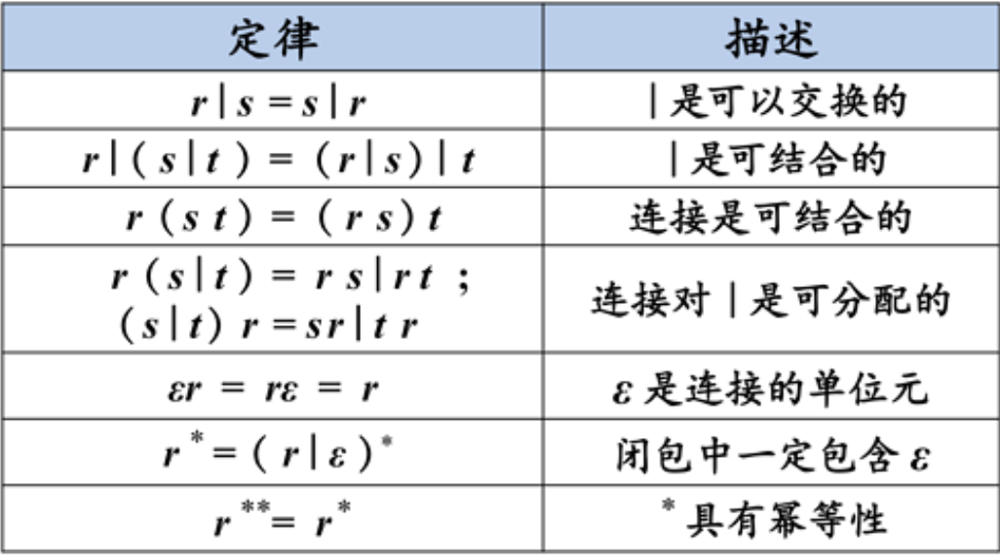

# 正规式和正规集

- 正规式又称为正则表达式
- 正则表达式（Regular Expression，RE）是一种用来描述正则语言的更紧凑的表示方法
- 正则表达式可以由较小的正则表达式按照特定规则递归地构建。每个正则表达式r定义（表示）一个语言，记为L（r）。

# 正规集的定义

- 能用正规表达式或正规文法表示的集合称为正规集。

| 正规式  | 正规集                     |
| ------- | -------------------------- |
| a       | {a}                        |
| a\|b    | {a,b}                      |
| ab      | {ab}                       |
| (a\|b)* | {ε,a,b,aa,ab,ba,bb,aaa,……} |