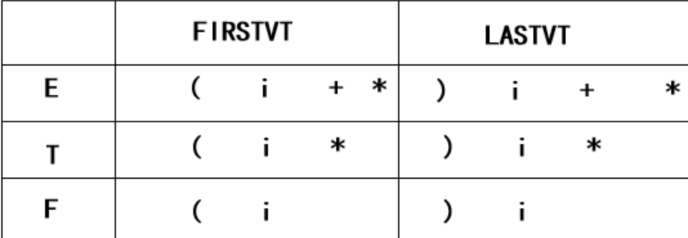
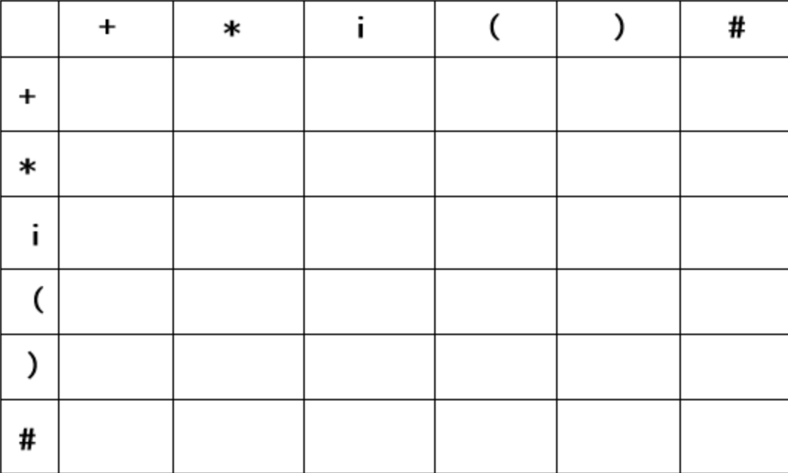
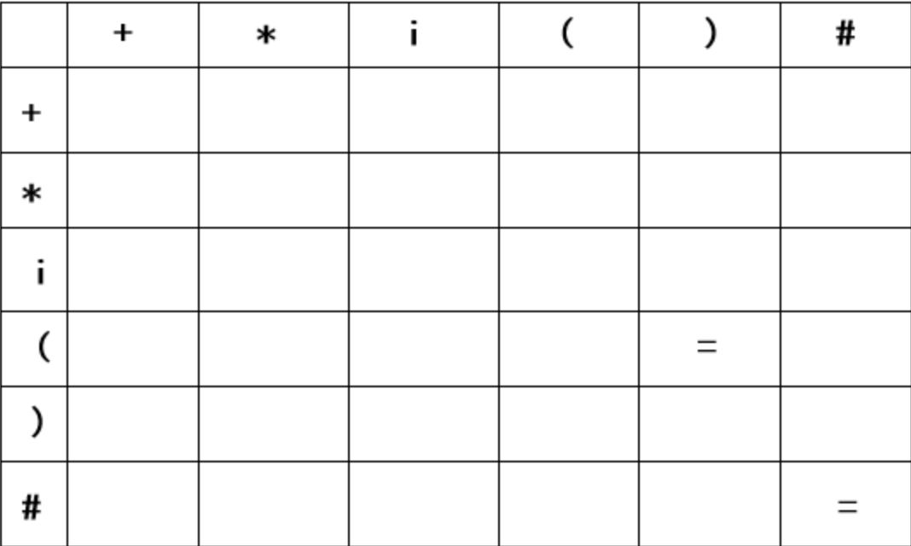
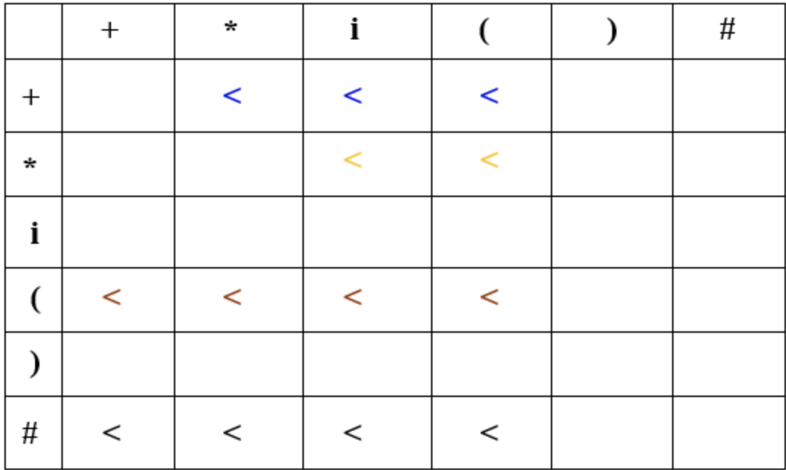
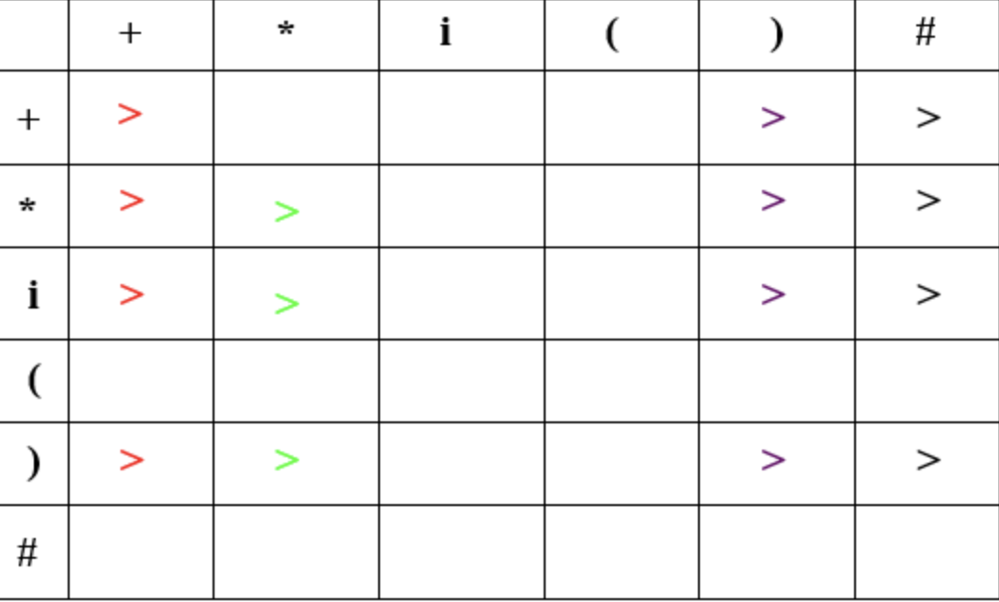
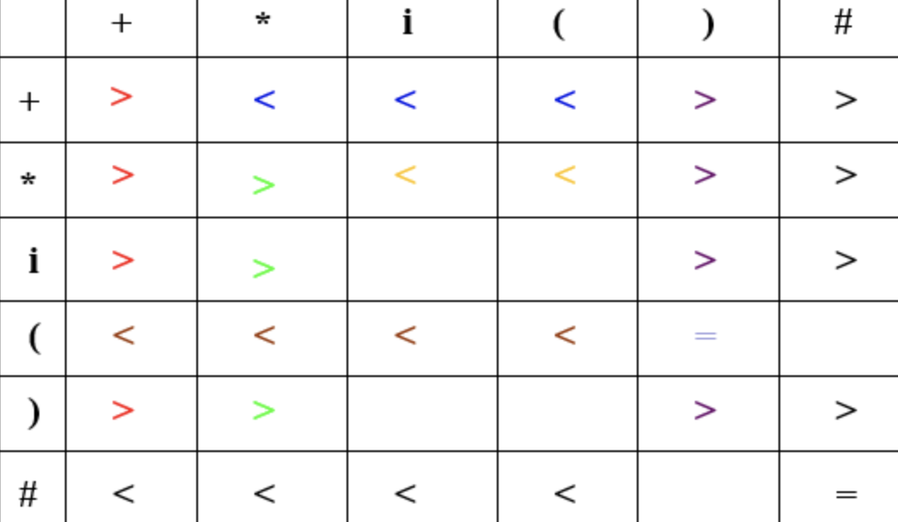

# 算符优先分析


## #define

```c
#define Ends 终结符
#define NotEnds 非终结符
```


## FirstVT

```
如果要找A的Firstvt，A的候选式中出现：
    A -> a.......，			即以终结符开头，该终结符入Firstvt
    A -> B.......，			即以非终结符开头，该非终结符的Firstvt入A的Firstvt
    A -> Ba.....，			即先以非终结符开头，紧跟终结符，则终结符入Firstvt
```


## LastVT

```
如果要找A的Lastvt，A的候选式中出现：
    A -> .......a，			即以终结符结尾，该终结符入Lastvt
    A -> .......B，			即以非终结符结尾，该非终结符的Lastvt入A的Lastvt
    A -> .....aB，			即先以非终结符结尾，前面是终结符，则终结符入Firstvt
```


## 举例

### 文法

```
	E → E+T | T
	T → T*F | F
	F → (E) | id
```


### VT定义

```
(1) a=b:  G中有P→. . .ab. . .		或P→. . .aQb. . .
(2) a<b:  G中有P→. . .aQ. . .		且Q=>b…或Q=>Rb...
(3) a>b:  G中有P→. . .Qb. . . 	且Q=>. ..a或Q=>…aR
```


### 关系表构造

1.  添加`E -> #E#`

2.  求出`FirstVT 和 LastVT`集

    1.  `FirstVT`
        1.  `E -> E+T`符合第三条规则，所以`FirstVT(E) += {+}`
        2.  `E -> T`符合第二条规则，所以`FirstVT(E) += FirstVT(T)`
        3.  同理可得`FirstVT(T) += {*} + FirstVT(F)`，`FirstVT(F) += {(} + {id}`
        4.  综上可得 `FirstVT(F) = {(, id}`， `FirstVT(T) = {*, (, id}`，`FirstVT(E) = {+, *, (, id}`
    2.  `LastVT`
        1.  `E -> E+T`符合第三条规则，所以`LastVT(E) += {+}`
        2.  `E -> T`符合第二条规则，所以`LastVT(E) += LastVT(F)`
        3.  同理可得`LastVT(T) += {*} + LastVT(F)`，`LastVT(F) += {), id}`
        4.  综上可得`LastVT(F) = {), id}`，`LastVt(T) = {*, ), id}`，`LastVT(E) = {+, *, ), id}`

    即

    

3.  画出表的结构（由全部的终结符组成）

    

4.  找出形如 `aQb(Ends NotEnds Ends)` 和 `ab(Ends Ends)`形式的

    上面例子中为`(E)和#E#`，写入`=`

    

5.  找出形如`aQ(Ends NotEnds)`形式的

    上面的例子中为`(E、#E、+T、+F`，将`FirstVT(Q)`中的所有坐标填上`<`

    

6.  找出形如`Qa(NotEnds Ends)`形式的

    上面的例子中为`E)、E#、E+、T*`，填入`>`

    

7.  最后的结果

    

    


### 可知

```
从上表可知：
    (1)相同终结符之间的优先关系未必是=
    (2)有a<b，未必有b>a
    (3)a、b之间未必一定有优先关系

故=、<、>不同于关系运算符“等于”、“小于”、“大于”
```

